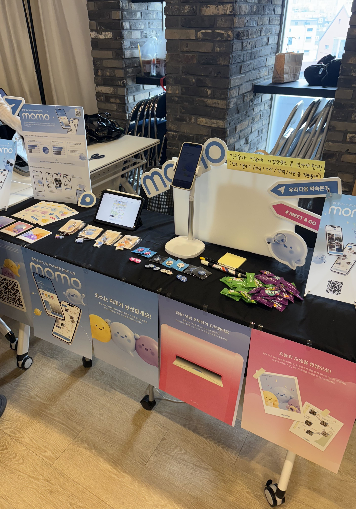

안녕하세요! 오랜만에 글을 올립니다. 이번에는 지난 7~8월 동안 제가 참여했던 DND에 대한 내용을 적어보려고 합니다.

# DND 소개와 지원 계기

DND는 서울에 편중되어 있는 기술 공유와 세미나를 지방에서도 나누고자 2019년에 설립된 전국단위 사이드 프로젝트 동아리입니다.

DND는 여름과 겨울기수로 운영되는데 저는 이번 15기 여름기수로 지원하게 되었습니다.

사실 대학생때 부터 참여하고 싶었으나 학업에 신경쓰고 실력도 부족하다고 생각해서 주저했었습니다. (후회합니다)
하지만 이제는 졸업 후라 시간도 있고, 실력도 어느정도 채워졌다 생각해서 지원했습니다.

# 지원서 작성 및 결과 발표

그래서 15기 모집 공지를 확인하고 아래 지원서 문항을 작성하기 시작했어요.

- DND의 **지원 동기**를 알려주세요. 그리고 활동을 통해 어떤 **목표**를 이루고 싶은지 소개해주세요.
- 현재 가장 관심 있는 **서비스 또는 AI를 알려주세요.** 그리고 주로 어떻게 활용하고 있는지 소개해주세요.
- 개발 과정에서 **좋은 협업**을 위해 내가 시도했던 노력과 결과를 소개해주세요.
- 지금까지 진행한 개발 활동 중 **가장 자신있는 프로젝트 링크와 프로젝트를 자신있게 소개한 이유**에 대해서 자세히 설명해주세요.

DND는 따로 면접이 없고, 3000자 내외 지원서로만 합격 유무가 결정되기 때문에 지원서 작성에 공을 들이는게 중요하다고 생각했습니다. 그래서 AI를 사용하지 않고 서툴지만 저의 열정을 보여드리고 싶어서 한 자 한 자 직접 적었던 것 같아요.

사실 마감일 하루 전날까지 지원서를 마무리 짓지 못해서 그냥 AI를 사용해서 붙혀넣고 싶다는 유혹도 있었지만, 그 다음날 개인적으로 힘든 하루를 보낸 탓에 부정적인 감정이 절박함으로 변해서 그런지 몰라도 끝내 지원서를 완성할 수 있었습니다.

결과는 예비 합격이었습니다. 이메일로 다른 분이 참여를 취소하시면 결과를 알려주신다는 내용이 있었고 기다렸습니다. 그리고 저의 절박함이 하늘에 닿았는지는 모르겠지만, 최종 합격 메일과 함께 DND 15기에 합류하게 되었습니다.

# 활동 진행

DND는 8주 과정이 크게 보면 기획, 개발환경 설정 및 개발, 데모데이로 이루어져 있었습니다. 매 주마다 필수적으로 참여해야하는 팀 별 정기회의가 있고 각 시기에 프로젝트의 방향을 잘 이끌어줄 수 있는 팀 미션이 있어서 원할하게 진행할 수 있었던 것 같아요.

## 기획

학교나 각종 대회에서 프로젝트에 앞서 문제정의와 그에 알맞은 기능을 정의하는 것이 중요하다고 들어왔고, 저도 동의합니다만 체계적으로 어떻게 진행할지는 항상 어려웠던 것 같습니다. DND에서는 팀미션 가이드에 따라 아래 내용에 대해서 기획 단계에서 부터 체계적으로 논의를 진행해 나갈 수 있었습니다.

- 문제정의
- 가설설정
- 사용자 모델링(Persona 설정), 유저스토리 설정
- 기능 정리 및 IA 작성

저희 팀은 여러번의 팀 회의를 통해 **친구·모임의 장소를 저장해 AI가 이동 동선까지 고려한 코스를 짜주는 모임 설계 서비스**를 구현하기로 결정하고 개발에 들어갔습니다.

## 개발환경 설정 및 개발

7월 말 오프라인 모각작으로 만나기전 프론트엔드 파트 회의를 통해 개발환경 기술 스택을 정했습니다. 그리고 필요할 때 마다 프론트엔드 파트 회의시간을 잡고 디자인 파트에서 작업한 피그마 시안을 보면서 작업분배를 한 다음 개발을 진행했습니다.

구현에 대해서 말해보자면 저는 원래 AI 신중론자로 제가 작성할 수 없는 코드는 AI로 생성하지 않는다는 생각을 갖고 있었고 대부분 기능을 직접 구현해야 직성이 풀리는 사람이었습니다. 하지만 4주안에 개발과 QA를 끝내야하는 상황에서 AI 코딩 에이전트의 필요성을 느끼고 적극 활용했습니다.

여기에 대해 좀 더 설명하자면 어떤 페이지를 구현해야할 때면 AI 코딩 에이전트(저는 opencode를 주로 사용합니다)와 함께 아래의 단계로 진행한 다음 완료되면 github pr 초안 검토 후 pr 생성도 요청하는 방식으로 활용했습니다.

1. 관련 컴포넌트 파일 및 Figma JSON Exporter로 피그마 페이지의 정보를 JSON 형태로 가져온다음 프롬프트에 추가해서 구체적인 컴포넌트, 라이브러리를 작성하는 계획을 요청하기 (opencode에서는 Figma MCP가 아직 공식지원이 안됩니다 ㅠㅠ)
2. 작성 계획을 보고 생각과 안맞는 부분 수정 요청
3. 파일을 수정할 수 있게 build 모드로 바꾸고 적용 요청

그리고 문제해결을 할 때도 이와 비슷하게 아래 처럼 진행했던 것 같아요.

1. 문제 원인을 찾고 해결방법의 **장단점**을 설명해보라고 하기
2. 괜찮은 방법 같으면 적용 계획 세워보기
   1. 적용했을 때 생각과 다르면 수정 이전으로 되돌려서(revert) 진행하기

신기한 점은 AI 코딩 에이전트가 기존 프로젝트의 코드, 프로젝트 구조, 테스트를 그대로 읽고 활용하기 때문에 프로젝트가 어느 정도 진행되었을 때는 더 매끄럽게 작업을 진행할 수 있었습니다. 컴포넌트를 잘 만들고, 아키텍처를 잘 설계하는 것이 AI 에이전트와 사람 모두에게 도움이 된다는 것을 다시 한 번 깨달았던 것 같습니다.

여기서 끝나면 일반 프로젝트와 다를 것이 없겠죠?
DND는 마지막 데모데이에서 다른 사용자 분들이 프로젝트를 직접 사용해보는 시간을 가집니다. 그렇기 때문에 구현된 기능이 잘 작동하는 지 확인하고 수정하는 **QA과정**을 거쳐야합니다. 데모데이까지 마지막 주는 실제로 디자인 파트, 백엔드 파트 모두에서 기능 동작에 대해 좋은 의견을 내주셨고 데모데이 당일 새벽 3시까지 수정사항을 최대한 적용했습니다.

곰곰히 생각해보면 다른 프로젝트에서라면 어물쩍? 넘어갔을 수도 있겠지만 **데모데이에서 만날 사용자와 열심히 해오신 팀원 분들을 생각했을 때 그럴 수는 없었던 것 같습니다.**  
(그럼에도 불구하고 모든 부분을 적용하지는 못해서 아쉬웠긴 했습니다)

## 데모데이

데모데이는 각 팀이 부스를 꾸미고 5분씩 발표를 마친 다음 자유롭게 부스를 운영할 수 있게 진행되었습니다. 수면 부족으로 인해 피곤했었지만 실제 제가 개발한 서비스가 사용자를 만났을 때 성취감을 느낄 수 있었던 것 같습니다.

서비스가 궁금하신 분은 [DND 프로젝트 소개 페이지](https://dnd.ac/projects/108)에서 소개와 함께 만나보실 수 있습니다!

# 느낀점

DND 프로젝트를 진행하면서 많은 것을 느꼈지만 2가지가 가장 큰 것 같습니다.

## 비개발 파트와 협업

보통 학교에서의 프로젝트는 비슷한 전공 즉 개발자와 협업을 할 확률이 높습니다.
하지만, 개발자는 결국 비개발 파트와 협업도 필요합니다. 특히 프론트엔드 개발자라면 그렇습니다. 모든 경우가 다 그런 것은 아니지만, 개발자가 만든 디자인은 결국 구현하기 수월한 것에 초점이 맞춰지는 경우가 많은데 좋은 디자인은 기획 의도를 잘 표현하는 것이 아닐까 생각합니다. 결국에는 개발자는 그런 의도를 현실 세계에 작동하는 제품으로 만드는 역할을 해야한다는 것을 깨달았던 것 같습니다.

## 열정

저와 같은 프론트엔트를 맡았던 다른 개발자 분께서 직장에 다니시면서 밤 늦게 까지 커밋을 남기시는 것을 보면서 많이 반성했던 것 같습니다.

처음 개발을 시작했을 때 시간을 가는 줄 모르고 몰입했던 순간들, 다른 사람이 제가 만든 소프트웨어를 사용해줄 때 기쁨과 성취감을 다시 한 번 느끼고 싶다는 생각이 들었습니다.

그렇기에 더 열심히 해볼려고 합니다.

# 마치며

최근 주변에서 말이 많습니다.
주식 시장이 AI로 인해 급등하고, 최신 모델의 성능에 사람들의 이목이 집중되면서

> AI가 개발자를 대체하는 것 아니냐

라는 걱정이 많습니다. 저도 당연히 가끔 그런 걱정을 하기도 합니다.

그렇지만 뭐 상관없습니다. 새벽 3시까지 기꺼이 작업하는 **열정**과 제가 만든 기능이 원하는 대로 동작하고, 사람들이 좋아해줄 때의 **기쁨**은 AI가 대체할 수는 없으니깐 말이죠.

걱정대신 응원을 부탁드립니다!