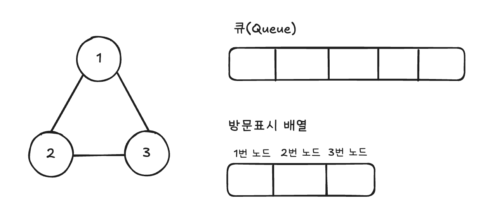
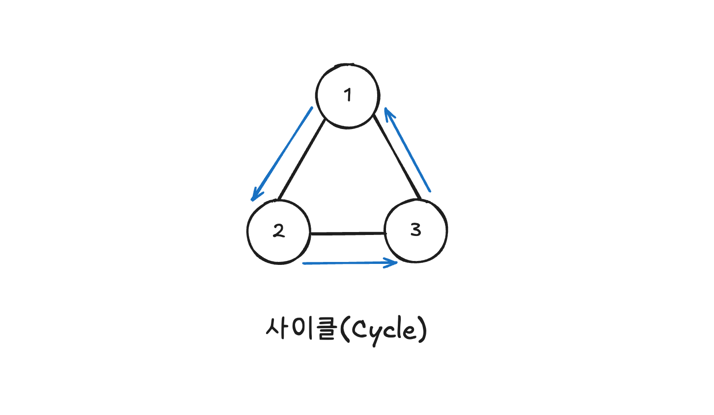
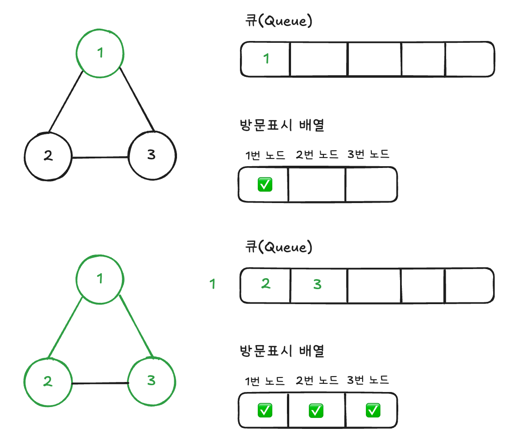
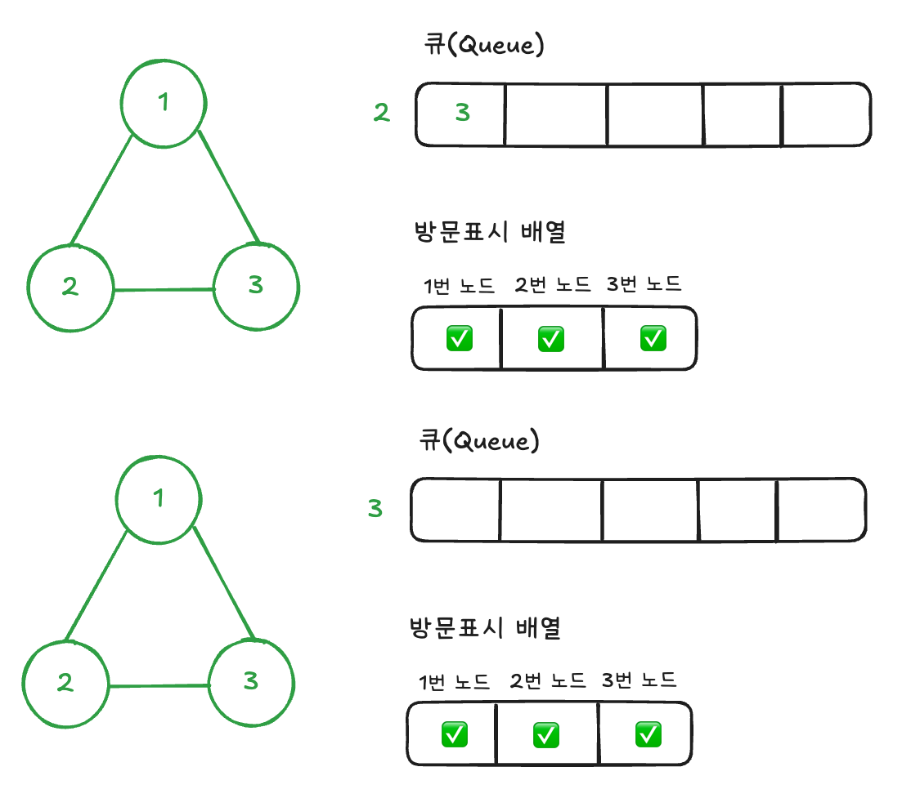
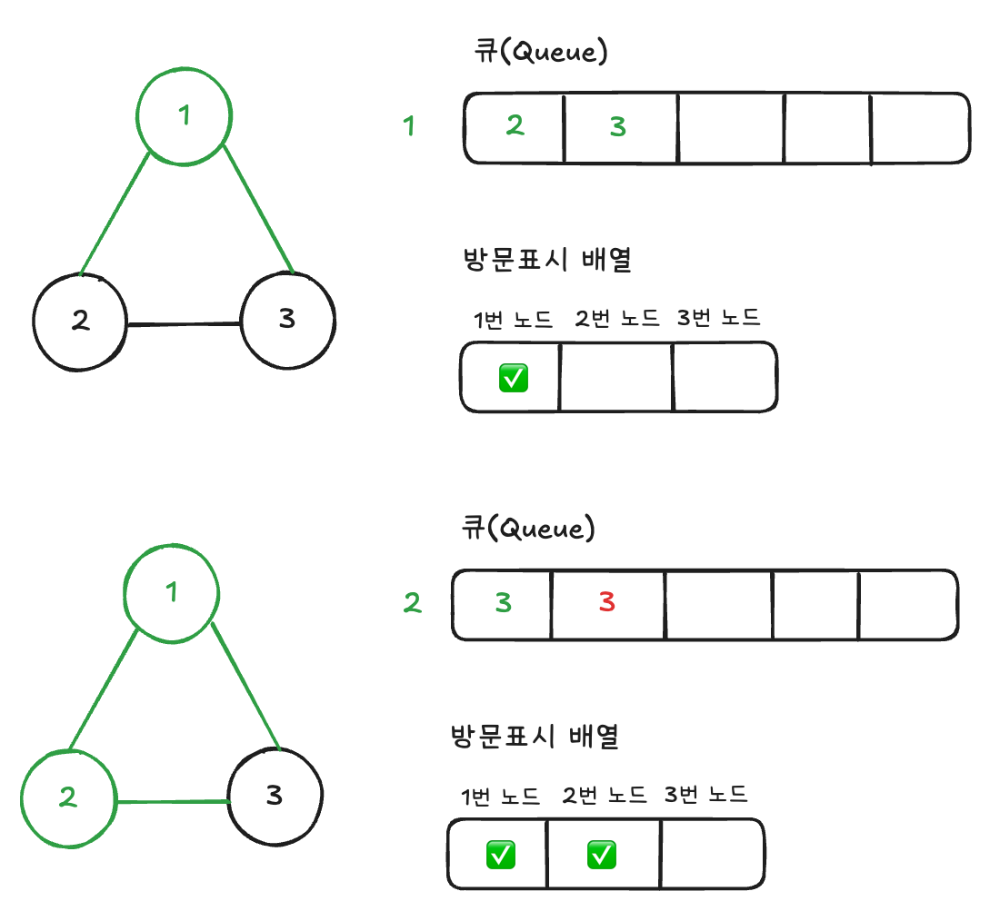
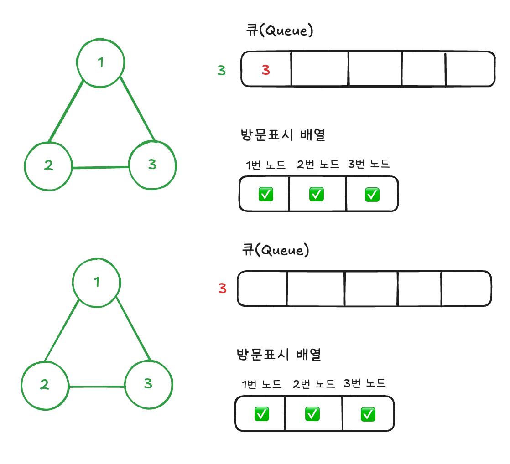

안녕하세요! 오늘은 BFS를 처음 구현할 때 흔히 하는 실수와 올바른 방법에 대해 알아보고자 합니다.

## 간단 개념 설명

너비우선탐색 줄여서 BFS는 그래프 탐색 알고리즘에 하나로, 간선에 가중치가 없는 그래프를 한 노드에 대하여 이전에 방문하지 않은 모든 인접 노드를 차례대로 방문하는 알고리즘입니다.

보통 위 그림과 같이 자료구조인 큐와 함께 구현하고, 다음과 같은 로직으로 구현합니다.

1. 처음 방문하는 노드를 큐에 넣고, 방문 표시 하기
2. 큐가 빌 때 까지 아래과정을 진행
	1. 큐에서 노드를 빼기
	2. 1. 에서 뺀 노드와 인접하고 방문하지 않은 노드를 **큐에 넣고 방문 표시하기**

## 의문점 발생
하지만, BFS를 처음 구현하다보면, 어짜피 방문한 노드를 큐가 빌 때까지 뽑게 되는데, 아래와 같이 뽑았을 때 방문표시를 하면 안될까? 라는 생각을 하실 수 있습니다. 

1. 처음 방문하는 노드를 큐에 넣고, 방문 표시 하기
2. 큐가 빌 때 까지 아래과정을 진행
	1. 큐에서 노드를 빼기
	2. **1.에서 뺀 노드를 방문 표시하기**
	3. 1. 에서 뺀 노드와 인접하고 방문하지 않은 노드를 **큐에 넣고 방문 표시하기**

결론만 말하자면, 위 방식대로 구현하면 BFS가 올바르게 동작하지 않을 가능성이 높습니다.
## 문제
그래프는 어떤 노드를 출발해서 다시 해당 노드로 돌아오는 경로인 **사이클**이 존재할 수 있습니다. 

이 때 문제가 생깁니다. 사이클이 없는 그래프인 트리 자료구조에서는 사이클이 없기 때문에 다시 노드를 방문하는 경우가 생기지 않습니다. 하지만 사이클이 있는 그래프에서는 방문 표시를 큐에서 뽑은 다음 하게 되면, 중복 방문할 수가 있습니다. 예를 통해 살펴봅시다.

아래와 같이 세 노드로 구성된 가중치, 방향이 없고 사이클이 있는 그래프의 예를 살펴봅시다.
### 정상적인 BFS

정상적인 BFS 즉, 노드를 큐에 넣는 시점에 방문표시를 하는 BFS는 사이클이 있더라도, 1번 노드와 연결된 노드를 모두 큐에 넣을 때 방문 표시하기에 노드가 한 번만 큐에 들어가게 됩니다. 그렇기 때문에 최소한의 연산으로 BFS를 진행하게 되는 것이죠.

### 문제있는 BFS

하지만, 큐에서 노드를 꺼냈을 때 방문표시를 진행하는 BFS의 경우 큐에 넣을 때 방문표시가 되지 않기 때문에
노드 2와 인접한 노드 3을 큐에 다시 넣기 때문에 큐가 빌 때까지 진행하는 BFS의 특성상 정상적인 BFS보다 한 번의 연산을 더 하게됩니다.

여기서 고작 하나의 노드가 추가되는 것이 그렇게 문제인가 생각하실 수 있지만, 규모가 크고 사이클이 많은 그래프에서는 **엄청난 양의 중복된 노드가 큐에 추가되기 때문에 메모리 공간을 훨씬 더 많이 사용하고, 시간이 더 걸리게 됩니다.** 메모리 공간 및 시간 제한이 있는 코딩테스트나 대회에서 문제가 발생할 수 있는 것이죠.  그리고 BFS의 특성을 이용하여 최단 거리를 구하는 문제일 경우 **오답이 발생**할 수도 있습니다.
## 결론

결론적으로 BFS를 진행 할 때 노드를 큐에 추가할 때 방문 표시 처리하시는 것이 좋은 방법입니다.  
참고하셔서 구현하시면 될 것 같습니다. 혹시나 글과 사진에 문제가 있으면 말씀해주세요! 
읽어주셔서 감사하고 더 좋은 글로 돌아오도록 하겠습니다. 감사합니다!

