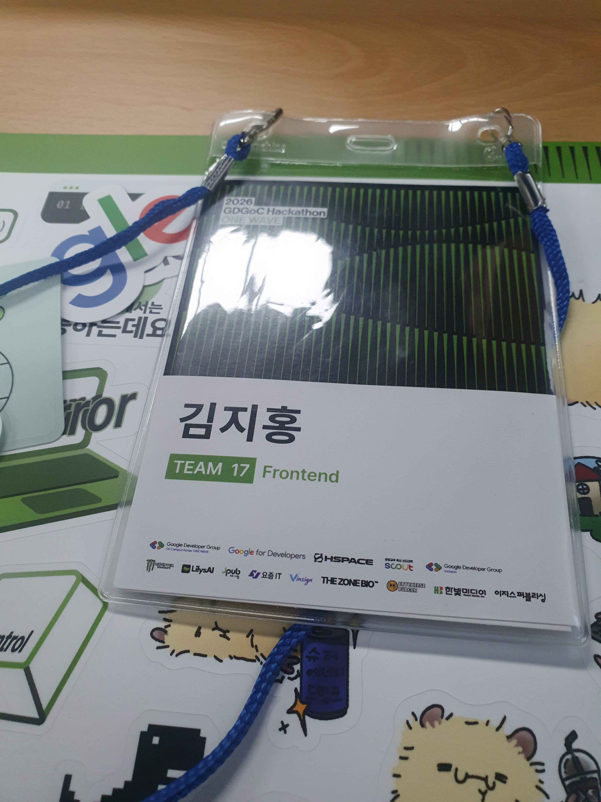
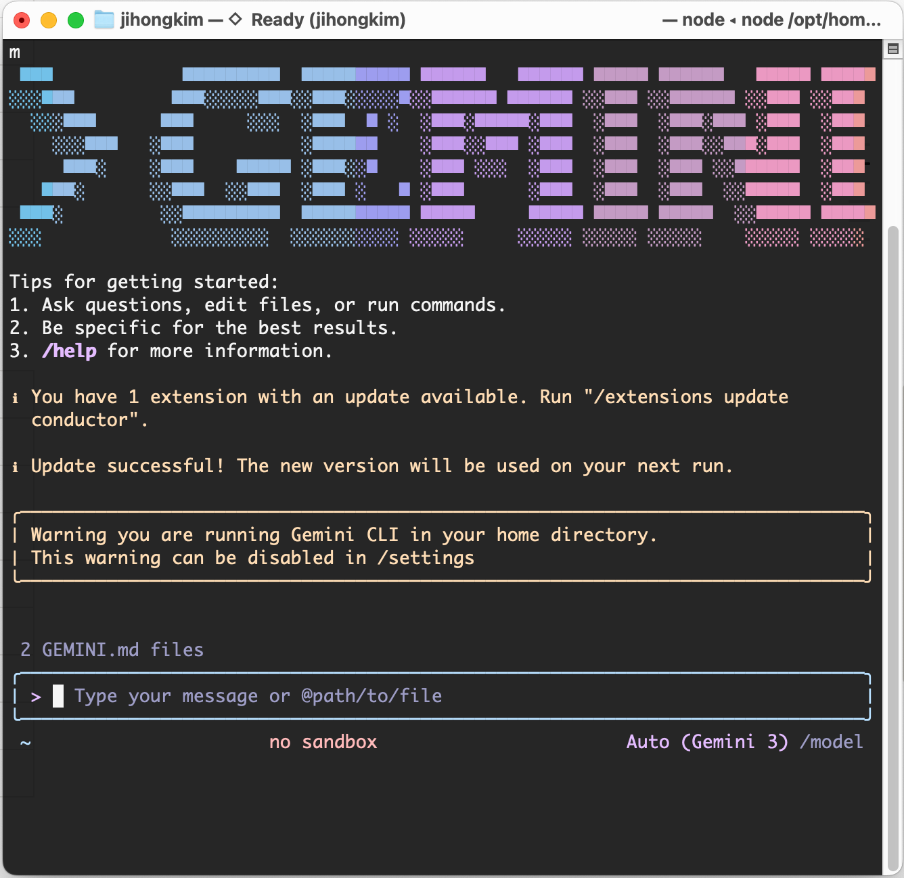
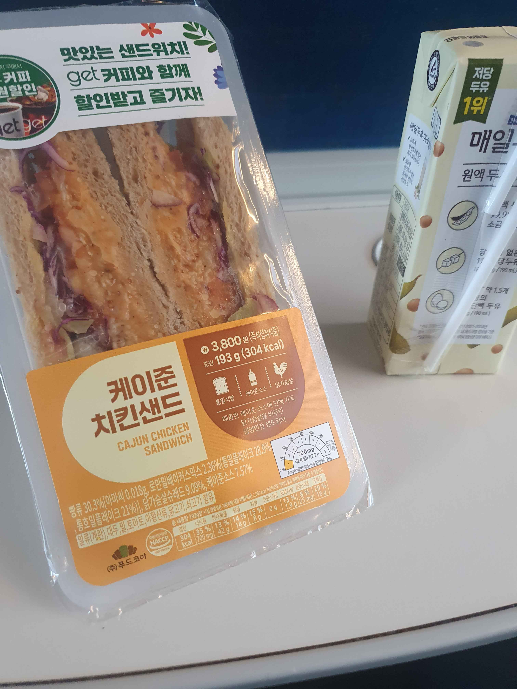
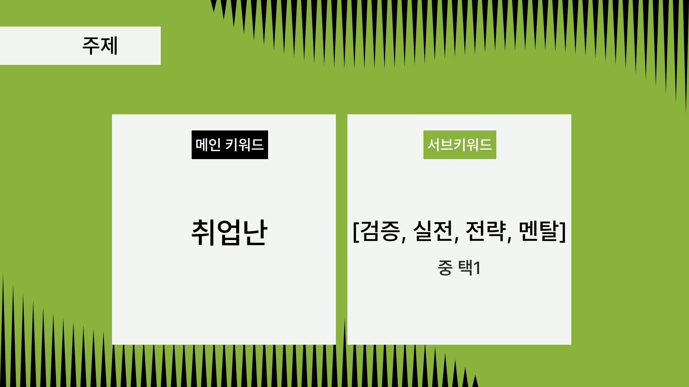

안녕하세요. 오늘은 최근에 참가했었던 2026 GDGoC 연합해커톤 : ONE WAVE에 참여한 후기를 가지고 와 보았습니다.

# 참여계기

사실 지난, 대학교 4년의 시간동안 수도권에서 진행하는 해커톤, 기술 컨퍼런스 같은 행사에 참여하는 것을 학교 시험이나 여러 다른 일정으로 인해 주저했던 적이 많았습니다.

매번 "다음 기회에..." 였는데, 정신을 차리고 보니, 이제는 **졸업 전 마지막 기회**라 생각이 들었습니다.
그렇기에 이번 GDGoC 연합해커톤은 반드시 참여하여 무엇이라도 얻고 와야겠다는 마음으로 참여했던 것 같습니다.

# 해커톤

## pre-해커톤

해커톤 참여 신청 후에, 디스코드 서버에 참여할 수 있었고, 몇일 뒤, 참가자 등록을 할 수 있었습니다.
참가자 등록은 운영진 분들이 직접 만드신 것 같은 등록 페이지에서 할 수 있었는데, 신청 이메일을 입력하면 팀 매칭 결과를 알 수 있었고 구글 클라우드 크레딧을 받을 구글 계정 등록도 할 수 있어서 인상 깊었습니다.

그리고 2월 2일에는 GDG Incheon 운영진 분이 진행하는 해커톤 특강을 들을 수 있었는데요, 해커톤 팁(프로젝트에 AI 기능을 추가할 때 고려해야할 점, 바이브 코딩 관련 등)과 Google Developer Group이 후원하는 만큼 Gemini CLI 관련 핸즈온하는 시간도 가졌습니다.

## 해커톤 본 행사

### ~ 해커톤 주제 공개

대망의 해커톤의 날이 밝았습니다.
제가 살고 있는 창원에서 서울에 있는 동국대학교 혜화관으로 늦어도 오후 1시까지 이동해야합니다.

저는 총 2일의 여정이기 때문에 KTX 좌석을 2회 지정할 수 있는 [내일로 패스](https://www.korail.com/tour/freeTravel/railro/passIntro)를 활용했습니다.
(만 29세 이하인 저는 왕복 요금이 7만원으로 일반 KTX보다 3만원 이상 저렴했습니다. 다른 분들에게도 강추합니다!)

아무튼 동국대 혜화관 행사 장소에 도착해서 체크인 후, 간단하게 팀원 분들과 통성명하다 즐거운? 아이스 브레이킹 시간을 가졌었습니다. 가장 기억에 남는 것은 그림 보고 개발 용어 맟추기 였던 것 같은데, 아직도 "브랜치"를 설명하는 그림이 잊어지지가 않습니다.

간단한 행사 관련 설명과 안전교육이 지나고, 주제가 공개 되었습니다.
주제 메인키워드는 바로 **취업난**이었고 세부 키워드는 검증, 실전, 전략, 멘탈 중에 택1이 이었답니다.

### 개발

본격적으로 해커톤 개발에 시작하기에 앞서
해커톤 개발 장소(강의실)로 이동하여 팀원 분들과 프로젝트 주제에 대해 이야기하는 시간을 가졌습니다.

많은 의견이 나왔지만,

- 비수도권 구직자의 취업에 도움을 줄 수 있는 프로젝트
- 창업(작은 사업: Micro Business)에 도움을 줄 수 있는 프로젝트

주제로 좁혀졌고, 취업난 문제를 기존의 방식으로 해결하기 어렵다고 판단하여, 취업을 기다리기 보다는 **작은 사업이라도 쉽게 시작할 수 있게 도와주는 프로젝트**로 주제를 정했습니다. 세부 키워드는 "전략"이었던 것 같습니다.

필수기능을 정의하고 본격적으로 제가 맡은 프론트엔드 파트 개발을 시작했습니다.

기초적인 개발환경 세팅을 마치고, UI 디자인을 위해서 디자인에 관한 프롬프트를 작성한 후, 특전으로 제공된 [Vinsign](https://vinsign.app/ko-kr) 크레딧을 사용해서 먼저 디자인 해보았는데, 전반적으로 와이어프레임 생성 및 HTML Export 기능은 훌륭했습니다만, 페이지를 하나씩 생성하는 것 보다 모두 한꺼번에 생성해주면 좋겠다는 생각이 들었습니다.

그래서, 같은 팀내에 프론트엔드 담당 분께서 디자인에서 구현까지 걸리는 시간을 줄여보고자 [v0](https://v0.app/)에 디자인 프롬프트를 입력하여 Next.js 기반의 프로젝트를 생성할 수 있었는데요, 생성된 프로젝트는 전체적으로 수정할 부분이 있었지만, 저희가 의도한 기능에 대한 맥락이 잘 표현되어 있었기 때문에 그대로 사용하되, 수정하기로 결정했습니다.

저는 일단 메인 홈 화면, AI 분석 , 업보트 피드와 피드 페이지, 팀 관련 로직을 전담해서 개발했습니다.
이번 해커톤에서는 코드를 직접 수정하지는 않고, Cursor를 사용하여 코드를 수정하고 생성했습니다.

일단 기본적인 프로세스는 제일 처음 v0에서 생성된 Next.js 프로젝트에서 PRD를 생성한 다음에

1. Cursor에게 구현할려는 기능(되도록 작은 크기)에 대해서 관련 자료(PRD, API 명세, 디자인 프롬프트)와 함께 설명
2. Agent 모드로 구현
3. 성공시, PRD에 반영하고, 실패 시 Ask 모드로 원인 확인 후 수정하거나 오류에 도움이 될 것 같은 정보(에러 메시지, HTTP 요청 헤더)를 제공하고 에러에 대해 설명을 하는 Agent 모드로 수정

의 방식으로 진행하였습니다. 특히 API 요청 관련 기능에는 Swagger에서 API 명세를 `.json` 형태로 추출하고, 해당 파일을 Cursor에게 첨부하여 프롬프트를 작성하니 대부분 오류없이 API 연동 코드를 생성할 수 있었다는 것이 꽤나 신선한 충격이었습니다.

그렇게 최종 제출 시간 약 1시간 전 까지 작업을 하고, 다른 프론트엔드 분이 PPT 작업을 하실동안 PPT에 필요한 사진을 준비하고 시연 영상을 녹화했습니다. 그리고 최종 제출이 끝이 났습니다.

<iframe width="560" height="315" src="https://www.youtube.com/embed/wjejv_8RCzo?si=WxICqs_iu6YH9SBz" title="YouTube video player" frameborder="0" allow="accelerometer; autoplay; clipboard-write; encrypted-media; gyroscope; picture-in-picture; web-share" referrerpolicy="strict-origin-when-cross-origin" allowfullscreen></iframe>

### 본선 발표

약간의 네트워킹 및 대기시간이 지나고, 대망의 본선 진출 여부 결과가 나왔습니다만, 아쉽게도 저희 팀은 본선에 진출하지는 못했습니다. 그래도 본선에 진출한 팀 발표를 보면서 느낀 점이 있었습니다.

물론 저희도 충분히 만족했다고 생각하지만, 본선에 진출한 팀 대부분에서 아래 내용이 더 도드라져 보였던 것 같습니다.

- 주제에 대한 **문제정의**가 명확하고,
- 그에 대한 해결책으로 진행한 프로젝트가 **설득력**이 있고
- **핵심기능** 위주로 구현되어 있습니다.
- 심지어 **사업성**도 있었습니다.

사실 위 내용은 이번 해커톤 뿐만아니라, 학교 캡스톤 디자인 프로젝트 수업이나 관련 활동 등에서 여러번 강조했던 내용입니다만, 정해진 시간내에 어떤 결과물을 내야하는 해커톤 특성상, 무심코 넘어가기 쉬웠던 것 같습니다.

앞으로 다른 개인 및 팀 프로젝트를 진행하면서도 좀 더 신경써야겠다는 생각이 들었습니다.

# 느낀 점 및 마무리

해커톤이 처음이었지만, 감사하게도 훌륭한 팀원분들을 만났고, 또 팀원 분들께서 열심히 참여해주셔서 저도 열심히 했고 다른 분들께 많은 것을 배울 수 있었습니다. 그렇기에 결과에 상관없이 정말 값진 경험이었습니다.

GDGoC DEU에서 운영진으로 활동하면서 저도 여러 작은 행사를 기획하고 진행했었는데요, 생각보다 고려해야 할 상황이 많이 있고, 번거로운 일도 종종 발생합니다. 그래서 이렇게 큰 행사를 진행하고 운영하는 것은 정말 쉽지 않은 일이라는 것을 잘 알고있기 때문에 수고해주신 **운영진분들께 다시 한번 감사드립니다.**

마지막으로 느낀 것은 제가 활동하는 부산 지역에서도 이런 행사가 활성화 되었으면 좋겠다는 생각이 들었습니다. 그렇기에 지난 GDGoC DEU에서 운영진으로 약 2년간 활동하면서 부산지역 연합 GDGoC 행사를 한 번이라도 진행했었으면 좋지 않았을까하는 생각에 아쉬움이 남습니다만, 혹시나 미래에 관련 행사가 진행된다면 스폰서나 연사자, 심사위원?의 역할이라도 꼭 참여해보고 싶다는 생각이 들었습니다.

아무래도 개발에 대한 열정은 사는 지역과 상관없으니깐요.

아무튼 **"서로 다른 물결이 만나 커다란 파도를 만든다"라는 ONE WAVE** 해커톤 이름처럼 모두가 하나되어서 최선을 다할 때, 좋은 결과물을 낼 수 있다는 것을 다시 한 번 느낄 수 있었던 해커톤이었던 것 같습니다.

그럼 여기까지 읽어주셔서 감사합니다. 다음에 더 좋은 글로 찾아오겠습니다.
