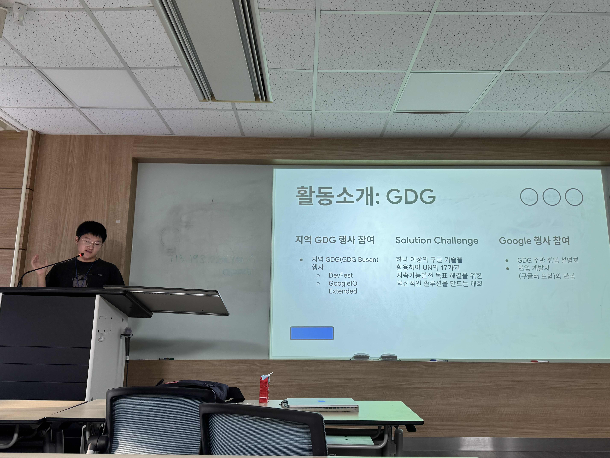
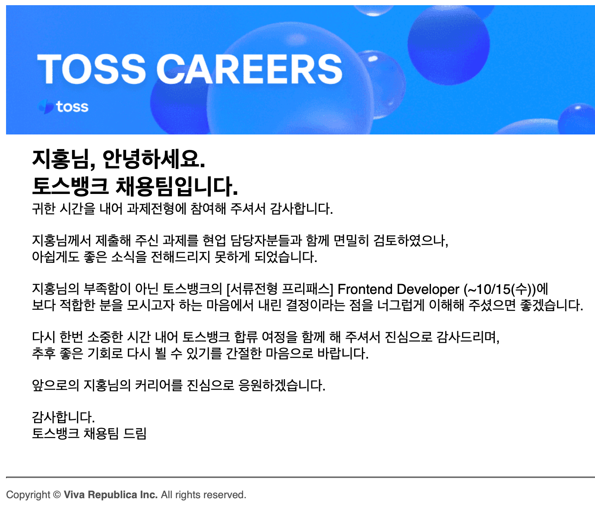
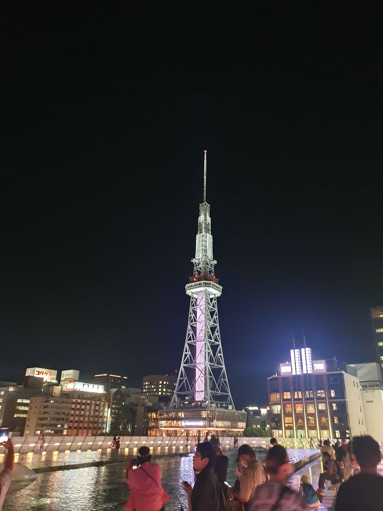

# 2025

## 학교생활

드디어 4년간의 학교생활을 마치고 졸업하게 되었습니다.

### GDGoC

올해도 GDGoC DEU에서 운영진으로 참가하여 여러 행사, 스터디를 진행하고, 세션에서 발표를 했습니다.

- HTML2React: HTML부터 리액트까지 배워보는 스터디
- 글쓰기(진행중): 월 마다 1개의 기술 관련 글을 쓰고 공유하는 스터디
- 프로젝트(진행중): 팀을 이뤄 프로젝트를 진행하는 스터디
- [인스턴트 Git/Github 발표](https://docs.google.com/presentation/d/1jevuBgSLB9Jt81jRHkXxSN7mjN86Dol_Podv_FIK-Tk/edit?usp=sharing)
- [기차코딩의 모든 것 발표](https://docs.google.com/presentation/d/1QQ__Qs-GTqkVZwq3L5VpZmkvXmbHUW6yLYyxT9iXIu0/edit?usp=sharing)
- [군대에서 코딩하기 발표](https://docs.google.com/presentation/d/1Boq0nDapyoYkfILnaBH-kwCHHn8g9vIN0IbvyIUO2ww/edit?usp=sharing)

졸업하는 내년 2월까지 계속 운영진으로 활동 후에 Alumni(졸업생)으로 전환할 것 같습니다.
2021년부터 동의대학교 GDSC 1기 멤버로 시작하여, 군 복무기간을 제외하고 약 2년 반 정도 활동해왔는데 개발에 열정이 있으신 좋은 분들과 뜻 깊은 경험을 할 수 있어서 감사했습니다. 개발 관련 분야에 관심이 있다면 꼭 참여해보시는 것을 추천합니다. (특히 운영진 강력 추천)

## 구직활동

지난 여름부터 구직활동을 시작했습니다. 일단 먼저 ICT 학점연계 인턴십에 지원했었는데요.
ICT 학점연계 인턴십은 사업에 참여하는 대학, 기업에 한해서 한 학기동안 인턴에 참여하고, 학점을 인정 받을 수 있는 프로그램입니다.  
저는 "되면 좋고, 안되면 아쉬운 것"이라는 마음으로 지원했습니다. 실제로 불합격하더라도

- 이력서 및 자기소개서 작성
- 코딩테스트 응시(심지어 영어)

를 경험할 수 있는 좋은 기회였기 때문에 도전했던 것 같습니다. 3개 회사에 지원했고, 결과는 아쉽게도 모두 서류불합격이었습니다만, 오랜만에 손에 땀을 쥐는 코딩테스트도 치뤄보고, 좋은 경험이었다고 생각합니다.

그리고, 10월에는 토스뱅크에서 진행하는 과제전형에 참여했습니다.

자세한 것은 비밀유지계약으로 인해 말씀드리기 어렵지만, 과제에 대한 문서를 읽고 기능을 정해진 시간내에 구현하는 형식으로 되어있던 것 같습니다. 제 실력으로 능숙히 구현하기는 꽤 어려웠습니다만, 그렇지만 과정이 **무엇보다도 재미있었고**, 저의 실력을 객관적으로 되돌아볼 수 있는 기회가 되어서 좋았습니다.

## 개발

올해는 개인보다는 주로 팀 프로젝트에서 프론트엔드 업무를 맡아 진행했습니다.

<iframe width="560" height="315" src="https://www.youtube.com/embed/oHyLopYRerM?si=KpGj83hqu322-ta1" title="YouTube video player" frameborder="0" allow="accelerometer; autoplay; clipboard-write; encrypted-media; gyroscope; picture-in-picture; web-share" referrerpolicy="strict-origin-when-cross-origin" allowfullscreen></iframe>

먼저, 캡스톤디자인II 수업에서 [위치기반 P2P 의류 대여 서비스](https://github.com/DevFlow-DEU/OpenCloset_frontend)라는 주제로 프로젝트를 진행했습니다.
처음으로 다른 프론트엔드 팀원과 같이 작업하다보니 생각보다 시행착오가 있었고, 보통의 캡스톤디자인 수업이 그렇듯 많은 보고서 작성과 발표는 힘들었지만, 좋은 팀원과 함께하여 무사히 마칠 수 있었던 것 같네요.

그리고 GDGoC에서 여름 프로젝트로 [Counter-Strike 2 유저 매칭 플랫폼](https://github.com/cs2match/frontend)을 개발했습니다만, 구현이 안된 기능도 어느정도있고, 현재는 운영하고 있지는 않습니다. 추후에 기회가 되면 공개하고 싶습니다.

마지막으로 최근에는 GDGoC 프로젝트 스터디에서 [여행기록 서비스 여기닷](https://github.com/yeogidot/yeogidot-frontend)을 만들고 있습니다. 해당 프로젝트는 배포 및 공개까지가 목표이기에 늦어도 2월에는 완성된 모습을 보여드릴 수 있을 것 같습니다. 열심히 개발해보겠습니다.

## 지난 해 계획 달성 여부

지난해 초 말씀드렸던 올해 목표

- **개인 프로젝트 진행**: 지금 보고계시는 **블로그**를 Astro로 개발했습니다.
- **Github Contribution 1000회 이상 달성**: **370회** 밖에 못했습니다. 숫자가 중요한 것이 아니라 열심히 개발하는 것이 중요하다고 느꼈네요.
- **월 1회 글쓰기**: 읽고 계시는 글까지 포함하면 **총 6회 달성**입니다.
- **이력서 / 자기소개서 작성 후 인턴 지원** : 위 내용 참고
- **책 최소 10권 읽기** : 대부분이 무라카미 하루키 에세이지만, 총 9권 읽었습니다.
  - 남극의 셰프
  - 발렌타인데이의 무말랭이
  - 샐러드를 좋아하는 사자
  - 내가 만난 하나님
  - 작지만 확실한 행복
  - 코끼리 공장의 해피엔드
  - 포트레이트 인 재즈
  - 요즘 개발자
  - 쿨하고 와일드한 백일몽

## 아쉬웠던 점

2025년도 지금와서 돌아보면 아쉬운 점이 꽤 있는데요 몇 가지를 뽑자면,

### 생활패턴 붕괴

공강이나 학교를 가지 않는 날에 일찍 일어나야하는 의무가 사라져버립니다.
그렇기에 늦잠을 자고, 잠깐 딴 짓을 하면, 하루가 의미없이 흘러가버리는 적이 많았네요.
지나가버린 시간들이 정말 아깝지만, 지금부터라도 열심히 해야합니다.

### 개발 시간 부족

프로 축구 선수의 삶에서는 당연히 축구가 높은 우선순위를 차지하고 있습니다.
저는 개발자 역시 마찬가지라 생각하면서도, 실제로는 늦잠, 웹서핑, 드라마 등 다른 것에 더 높은 우선순위를 두었던 것 같습니다. 당연히 개발에 투자하는 시간도 줄어들고, 그만큼 저의 성장도 늦어졌다 생각합니다. 오늘부터는 그런 **유혹을 이겨내고 개발에 더 많은 시간을 투자**하고 싶습니다.

### 팀 프로젝트 협업 미숙

위에서 말씀드린 것 처럼 여러 팀 프로젝트를 진행했었는데요, 개인 프로젝트는 진행한 적이 있지만, 팀으로 진행하는 프로젝트는 경험이 많이 없어 낯설고 어려운 점이 많이 있었습니다.

프론트엔드 파트 작업 분배를 어떻게 해야할지, 공통으로 쓰이는 컴포넌트는 어떻게 처리할 지 등에 대한 여러 고민이 있었고, 기획단계에서부터 기능에 대한 명세를 제대로 정리하지 않아서, 서로의 생각과 다른 기능을 구현한 사고도 있었네요. **기능 구현도 중요하지만, 협업에서의 문서화 및 의사소통 역시 중요**하다는 것을 다시 한번 느꼈습니다.

# 2026년, 전업 프론트엔드 개발자를 향해

2026년에는 졸업을 하고, 본격적으로 **전업 웹 프론트엔드 개발자를 목표**로 구직활동을 할 생각입니다.

현재는 **기본 근무형태가 재택인 기업**이나 고향인 **창원에서 출퇴근 할 수 있는** 경남권, 부산지역 회사를 목표로 준비하고 있습니다.

제가 전업 프론트엔드 개발자가 되고 싶은 이유는 많지만, 가장 중요한 것은 **웹 프론트엔드 분야에서 사람들이 사용하는 소프트웨어에 기여하는 것이 즐겁고** 가장 잘 할 수있기 때문입니다.

그렇기에 굳이 수도권 대면근무를 필수로 하는 회사가 아니더라도, 프론트엔드 개발자로 일할 수 있는 기회가 반드시 있을 것이라 생각하고 준비하고 있습니다.

그래서 이력서, 포트폴리오, 자기소개서 작성 및 수정 등 지원에 필요한 서류 준비는 물론 이거니와,
프론트엔드 파트에서는 **프로젝트를 계속 진행**해 나갈 생각이고, 개발자의 교양인 **CS(Computer Science)지식**에 대해서도 공부하며 준비할 생각입니다. 특히 알고리즘은 코딩테스트 준비를 위해서라도 꾸준히 해야겠죠.
아 참, **매월 글쓰기**도 계속 진행합니다.

# 번외

## 1종 보통 운전면허 취득

올해 2월, 도로주행을 무사히 마치고 운전면허를 취득했습니다.
1종 보통 면허는 수동 변속 기어와 클러치를 사용하기 때문에 변속 타이밍을 맞추는 것이 쉽지 않았습니다만, 무사히 합격하고 운전을 조금씩 하고 있습니다.

## 나고야에 도대체 뭐가 있는데요?

> 미소카츠, 히츠마부시, 우롱차, HARBS 케이크, 토요타 박물관 기타 등등...

고등학교 친구들과 나고야에 갔습니다. 첫 일본방문인데 꽤 좋았던 것 같네요.
맛있는 음식과, 볼 거리들이 있었지만, 무엇보다 밤에 숙소에서 오랜만에 만난 친구들과 하는 이야기가 가장 기억에 남습니다.

## 어쩌다 찬양단

어쩌다보니 교회에서 일종의 밴드 메인 보컬을 하게 되었습니다.
찬송가를 주로 부릅니다. 매주 일요일 1시 15분 즈음에 오시면 모든 곡을 감상?하실 수 있습니다.

# 마치며

아무튼 새로운 해를 맞이 하게 되었습니다. 지난 2025년을 돌아보면 힘들고 어려운일도 있었지만, 반면에 기쁘고 즐거운 일도 있었고, 무엇보다 주변 좋은 분들과 함께였기에 감사했습니다. 2026년도 잘 부탁드립니다.

감사합니다.
