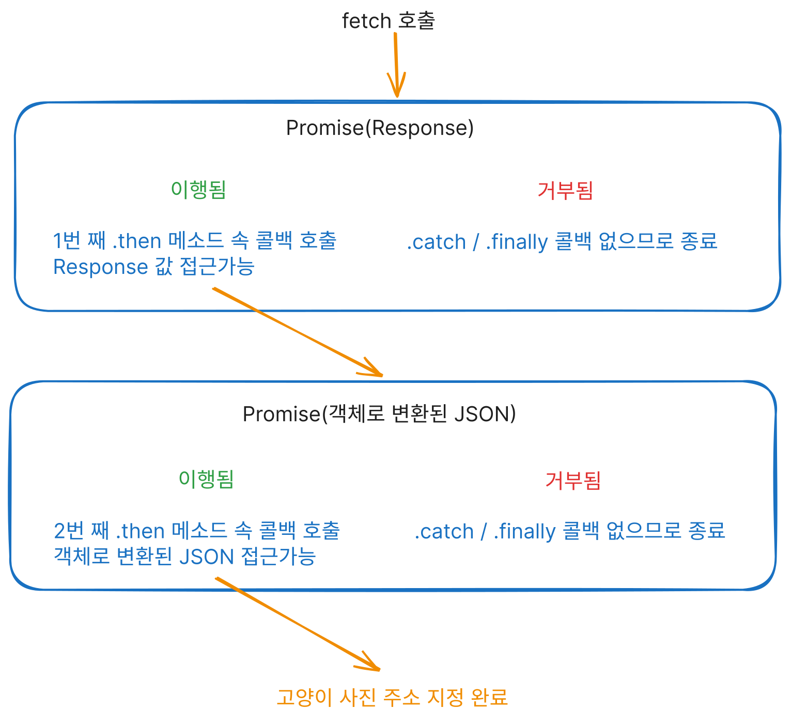

안녕하세요 오늘은 자바스크립트의 동기와 비동기에 대한 글을 작성해봤습니다.

## 동기와 비동기

sync, async

자바스크립트는 기본적으로 동기적으로 작업을 진행합니다.

보통 동기의 의미는 어떤 사건이 같은 시간대에 일어나는 것을 이야기 하는데요, 프로그래밍에서는 작업이 **시간관계로 볼때 순차적으로 진행**됨을 주로 이야기합니다. 하나의 작업이 끝나야 다음 작업을 시작할 수 있습니다.

```js
const year = 2026; // 1.
const nextYear = year + 1; // 2.
console.log(nextYear); // 3. 2027 출력
```

위 자바스크립트 코드를 살펴보시면, 위에서부터 아래까지
한 줄씩 **순차적으로** 실행되고 마지막에 `2027`이 출력되는 것을 확인하실 수 있습니다. 즉 동기적으로 실행되었습니다.

비동기는 동기에 반대되는 개념으로, 작업이 시간관계로 볼 때 **순차적으로 진행되지 않는 것입니다.** 즉 현재 작업이 종료될 때 까지 **기다리지 않고** 다음 작업이 진행됩니다.

위에서 자바스크립트는 기본적으로 동기적으로 작업을 진행한다고 했으나, HTTP 요청등 시간이 오래 걸리는 작업에서는 비동기적으로 처리합니다. 만약 동기적으로 동작을 한다면
[MDN 문서의 소수 구하기 예제](https://developer.mozilla.org/ko/docs/Learn_web_development/Extensions/Async_JS/Introducing#%EC%9E%A5%EA%B8%B0_%EC%8B%A4%ED%96%89_%EB%8F%99%EA%B8%B0_%ED%95%A8%EC%88%98) 처럼 웹사이트를 사용할 수 없을 겁니다. 심지어 버튼 클릭 조차도 말이죠.

그렇다면 JS에서는 비동기를 어떻게 처리하는 걸까요?
## JS 비동기 처리

자바와 같은 언어에서는 쓰레드를 활용하여 비동기 처리를 할 수 있지만, JS는 아쉽게도 싱글 쓰레드 언어입니다.

하지만, JS는 독립된 환경보다는 웹 브라우저, Node.js 같은 환경에서 실행됩니다. 이런 환경에서는 비동기 처리에 필요한 도구를 제공하고 있습니다. 다만 이번 글에서는 자세한 동작원리 보다는 활용 방법에 초점을 맞췄기 때문에 궁금하신 분은 여기에 대해 잘 설명한 [어쨌든 이벤트 루프는 무엇입니까?(JSCONF EU 2014)](https://www.youtube.com/watch?v=8aGhZQkoFbQ)을 참고하시면 좋을 것 같습니다.

## 비동기 처리 방법(HTTP 요청과 함께)

오래 걸리는 작업을 비동기적으로 처리한다는 것은 아시겠죠? 하지만, 비동기적으로 처리하는 작업도 순차적으로 진행해야 할 수 있습니다.

대표적으로 HTTP 요청을 보내고 나서 응답을 받은 후에 응답 데이터에 접근하는 것이 있습니다. 

그렇다면 JS에서 비동기적인 HTTP 요청과 응답을 어떻게 처리하는 지 살펴봅시다. 
### Callback
가장 먼저 생각할 수 있는 것은 바로 콜백입니다.
이름대로 Call + Back, 어떤 작업이 끝나고 나중에 호출할 함수를 전달하는 것을 말합니다.

WebAPI 중에 `XMLHttpRequest`란 함수가 있습니다.
이름에 XML이 적혀있지만 XML이 아닌 다른 데이터도 서버로 부터 요청하고 응답할 수 있는 함수입니다.

다음 예제는 [고양이 API](https://cataas.com)로 부터 HTTP 요청을 통해 사진 주소를 받아 이미지 태그로 보여주는 예제입니다.

<p class="codepen" data-height="400" data-pen-title="Untitled" data-default-tab="js,result" data-slug-hash="ZYBaXEg" data-user="jihongeek" style="height: 400px; box-sizing: border-box; display: flex; align-items: center; justify-content: center; border: 2px solid; margin: 1em 0; padding: 1em;">
  <span>See the Pen <a href="https://codepen.io/jihongeek/pen/ZYBaXEg">
  Untitled</a> by Jihong Kim (<a href="https://codepen.io/jihongeek">@jihongeek</a>)
  on <a href="https://codepen.io">CodePen</a>.</span>
</p>
<script async src="https://public.codepenassets.com/embed/index.js"></script>

예제 코드에서 `request.onload` 속성이 있습니다. 여기에 로딩이 완료되면, 호출될 함수 즉 **Callback**을 전달할 수가 있습니다. 

고양이 사진의 url 주소를 가져오는 HTTP 응답이 처리되었을 때 이 콜백을 통해서 `img` 태그의 `src` 속성을 지정할 수 있는 것입니다.

만약 콜백 대신, 바로 접근할려고 하면, **응답이 처리 되기도 전에 응답 값에 접근**하므로 정상적으로 사진 주소를 가져 올 수 없게 됩니다.

물론 콜백에도 문제가 있습니다. 만약 세 API를 순차적으로 호출해야한다면 어떨까요?
아마 아래 코드 처럼 콜백 세 개를 중첩하게 되겠죠? 이런 방식은 코드의 가독성을 떨어트리고, 유지보수를 어렵게 만듭니다. 

```js
request.onload = function () {
  ...
  const request2.onload = function () {
    ...
    const request3.onload = function () {
      ...
    }  
  }
}
```

그래서 어떻게 하면 비동기 처리를 콜백 말고 더 세련되게 할 수 있을까 해서 등장한 것이 `Promise`입니다.
### Promise

프로미스는 비동기 처리를 도와주는 하나의 객체로
생성 코드와 소비 코드를 연결해주는 역할을 합니다.

생성 코드는 작업이 오래걸리는 비동기 작업이고,  소비코드는 생성 코드가 종료된 후에 실행하는 코드라고 생각하시면 좋을 것 같습니다.

프로미스 생성코드의 실행 완료에 따라,

 * pending : 처리전 초기 상태
 * furfilled : 이행됨(처리 완료)
 * rejected: 거부됨(오류 발생 등의 이유로 처리 중단)

로 나뉘어 지고, 이에 따라 실행할 콜백함수를 줄 수 있습니다.

아래 예제는 위 고양이 사진 호출 예제를 `Promise` 객체를 반환하는 `fetch` API로 다시 작성한 것 입니다. 

<p class="codepen" data-height="396" data-pen-title="fetch &amp;amp; promise" data-default-tab="js,result" data-slug-hash="ZYBaaWK" data-user="jihongeek" style="height: 396px; box-sizing: border-box; display: flex; align-items: center; justify-content: center; border: 2px solid; margin: 1em 0; padding: 1em;">
  <span>See the Pen <a href="https://codepen.io/jihongeek/pen/ZYBaaWK">
  fetch &amp; promise</a> by Jihong Kim (<a href="https://codepen.io/jihongeek">@jihongeek</a>)
  on <a href="https://codepen.io">CodePen</a>.</span>
</p>
<script async src="https://public.codepenassets.com/embed/index.js"></script>

프로미스가 이행되었으면 `.then` 메소드로 콜백을 넘겨 줄 수 있고, 콜백의 매개변수로 이행의 결과로 반환되는 값을 가져와 사용할 수 있습니다.  또한 오류가 발생하는 등의 이유로 프로미스가 거부된다면 `.catch`, 이행여부에 상관없이 마지막에 호출되는 콜백을 전달하고 싶으시다면 `.finally` 메소드를 사용하시면 됩니다.

바로 위 예제에서는 총 두 번의 `.then` 메소드를 사용해서HTTP 요청, 응답 JSON 객체 변환이라는 2가지 비동기 작업을 순차적으로 진행하고, 마지막으로 사진 URL 지정등의 작업을 하였습니다.




콜백을 사용한다는 점에서 `XMLHttpRequest`의 예시와 차이가 없다 생각하실 수 있지만, 위에서 보시다시피 `.then`을 이어서 사용할 수 있다는 것이 큰 차이입니다.

`XMLHttpRequest`는 여러 비동기 함수를 순차적으로 호출하여 처리해야할 때 콜백을 중첩해서 사용해야 했지만, 프로미스는 `.then` 메소드를 사용해서 콜백을 중첩하는 것이 아닌 이어서(프로미스 체이닝) 사용 할 수 있어 코드의 가독성과 유지보수성에서 훨씬 좋은 장점이 있습니다.

### async & await
마지막으로 async와 await 키워드를 사용하는 방법이 있습니다. 일반적인 콜백과 프로미스를 사용하면서, 일반적인 자바스크립트 코드 처럼 기다려줬으면 좋겠다고 생각하셨을 수도 있을 것 같습니다.

async & await가 바로 그런 역할을 합니다.

`async`는 함수 앞에 붙히는 키워드로, 일반 함수를 프로미스를 반환하는 비동기 함수로 만들어줍니다. `await`는 이 비동기 함수 내에서 다른 비동기 함수의 호출을 단어 뜻 처럼 **기다리게** 할 수 있습니다.

아래 예제는 fetch 함수로 고양이 사진의 주소를 가져오는 예제를 `async` 과 `await`를 사용해서 수정한 것입니다.

<p class="codepen" data-height="397" data-pen-title="async &amp;amp; await" data-default-tab="js,result" data-slug-hash="wBopapQ" data-user="jihongeek" style="height: 397px; box-sizing: border-box; display: flex; align-items: center; justify-content: center; border: 2px solid; margin: 1em 0; padding: 1em;">
  <span>See the Pen <a href="https://codepen.io/jihongeek/pen/wBopapQ">
  async &amp; await</a> by Jihong Kim (<a href="https://codepen.io/jihongeek">@jihongeek</a>)
  on <a href="https://codepen.io">CodePen</a>.</span>
</p>
<script async src="https://public.codepenassets.com/embed/index.js"></script>

코드를 자세히 살펴보면, `fetch`가 반환한 프로미스가 이행될 때 까지 **기다렸다가 나온 `Response` 객체를** `response`에 저장하고, 
```js
const response = await fetch('https://cataas.com/cat?width=200', {
    headers : {'Accept' : 'application/json'}
  });
```

`response.json`이 반환한 프로미스가 이행될 때 까지 **기다렸다가 나온 객체를** `parsedJson` 저장하여 사진 URL을 이미지에 지정할 수 있었습니다. 

```js
const parsedJson = await response.json();
```

훨씬 코드가 직관적이고 이해도 잘 되는 것 같습니다. 그래서 아마 `await`를 일반 함수에서 사용할 수 있다면 참 좋을 거 같긴 합니다만, **`await` 키워드는 반드시 async 키워드로 선언된 비동기 함수에서만 사용이 가능합니다.**
 
# 마치며

아마 다른 프로그래밍 언어를 사용하다  자바스크립트를 사용하게되었을 때, 특히 프론트엔드에서 백엔드 API를 호출할 때,  동기적으로 코드가 실행이 되지 않아 당황하신적이  모두 계실 건데요. (저는 그랬습니다 ㅎㅎ)  아마 오늘 글이 그에 대한 해결책이 되지 않았나 생각됩니다.

글은 여기까지입니다. 혹시나 글 내용에서 오류를 발견하신다면, 언제든지 댓글로 알려주세요.

읽어주셔서 감사합니다!
