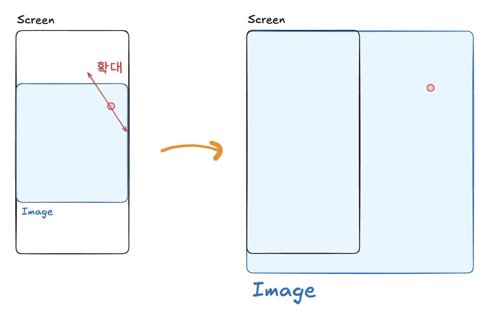
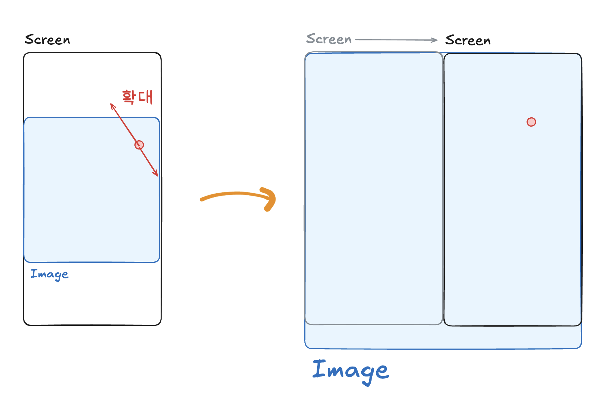
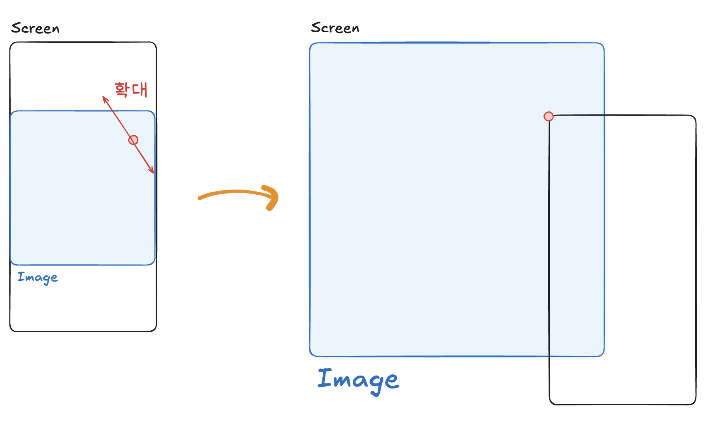
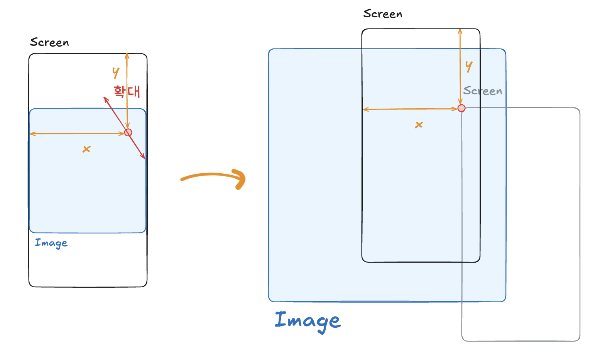

안녕하세요. 이번에는 핀치 줌을 직접 구현하고 배운 점을 정리해보았습니다.

# 개요

제가 최근에 개발하고 있는 여행 기록 서비스 여기닷에서는 여행사진을 쉽게 정리하고 관련 내용을 기록할 수 있습니다.
여행 사진을 정리하기 위해서는 먼저, 사진을 업로드하고 올바른 사진이 올라갔는지 확인해야겠죠?

그래서 저희는 아래 디자인과 같은 사진이 화면을 꽉 채우면서, 확대와 축소가 가능한 페이지가 필요하다 느꼈고,이에 따라 개발을 시작했습니다.

# 기본 개념

사진 앱에서 처럼 두 손가락의 제스쳐에 따라 확대, 축소하는 동작을 "핀치 줌"이라고 합니다.
웹 브라우저에서는 기본적으로 핀치 줌을 지원합니다만, 아래 영상 처럼 페이지의 전체 요소가 확대 되기 때문에
**이미지 요소만 확대** 되어야 하는 저희 디자인의 사례와는 맞지 않았습니다.

<video src="/ordinary_pinch_zoom.mp4" controls width="300px"></video>

(일반적인 웹 브라우저에서의 핀치 줌)

그래서 특정한 요소만 핀치 줌할 수 있는 라이브러리를 사용하거나, 직접 구현하는 방법 밖에 없었습니다.
라이브러리를 사용하면 쉽고 빠르게 기능을 구현할 수 있지만, 유명한 라이브러리는 핀치 줌 뿐 만아니라 프로젝트에서 사용하지 않는 다른 제스쳐도 포함하고 있는 경우가 많아 구미가 별로 당기지 않았습니다. 그리고 간단한 핀치 줌 정도는 구현 할 수 있을 것 같아서 직접 구현하는 것으로 결정했습니다.

## 전략

기본적인 전략은 간단합니다. 핀치 제스쳐에 따라, 사진을 담고 있는 `img` 태그의 `width` 속성을 키우거나 줄이면 됩니다.

- 축소: 스크린을 누른 두 손가락의 거리가 짧아 질 때
- 확대: 스크린을 누른 두 손가락의 거리가 길어질 때

처음에는 핀치 제스쳐에 대한 API가 따로 있을 줄 알았습니다만, 아쉽게도 존재하지 않아 `PointerEvent`를 활용해서 직접 구현해야 했습니다. 대신 [MDN 문서](https://developer.mozilla.org/en-US/docs/Web/API/Pointer_events/Pinch_zoom_gestures)에서 해당 내용을 잘 설명하고 있으니 참고하시면 좋을 것 같습니다.

아무튼, 핀치 제스쳐를 구현하고, 그에 따라 사진을 확대 축소하는 것을 과정을 그림으로 아래와 같이 나타낼 수 있습니다.

## 문제와 해결

다만, 위 그림에서 보셨다시피 문제가 있습니다. 확대와 축소는 왼쪽 상단을 기준으로 일어납니다.
그렇기에 확대 및 축소하여 보고 싶은 곳이 화면 밖으로 사라지는 문제가 발생하게 됩니다.

이 문제를 해결 하는법은 간단합니다. 확대(또는 축소)를 한 다음, 해당 지점으로 이동하면 됩니다. 저는 사진을 화면에 보이는 부분보다 크게 만들고 아래 그림과 같이 **제스쳐가 일어난 두 손가락의 중점**으로 화면을 스크롤 하는 방식으로 처리하였는데 편하신 대로 구현하시면 될 것 같습니다.

여기서도 중요하게 살펴볼 부분이 2가지가 있습니다.

1. **크기 변화에 따라** 터치 한 두 점의 **중점도 변경**되어야 함
2. Web API의 `.scrollTo` 메소드 **왼쪽 상단 기준으로 동작**

먼저, 확대나 축소를 진행하게 되면, 이전 크기의 사진에서 핀치 줌이 일어났던 점의 위치도 크기 변화 비율에 따라 바뀌게 됩니다. 따라서 정확한 위치로 스크롤 동작을 하기 위해서 제스쳐가 일어난 두 손가락의 중점의 (x,y) 좌표에 크기 변화 비율을 곱해준 점으로 이동해야 합니다.

또 다른 사항으로는 제가 사용한 Web API `.scrollTo` 메소드는 왼쪽 상단을 기준으로 스크롤하기 때문에 중점으로 스크롤하면 아래와 같이 중점이 왼쪽 상단에 가게 되는 현상이 발생하게 됩니다.

그래서 확대 축소를 했을 때, 화면의 왼쪽 상단에서 부터 두 손가락의 **중점까지 거리만큼 덜 스크롤**하면 자연스럽게 화면에 관심영역을 보여줄 수 있었습니다.

그 결과 최종적으로 동작하는 핀치 줌을 구현할 수 있었습니다.

아래는 리액트로 구현한 최종 구현 데모 영상입니다.

<video src="/homemade_pinch_zoom.mp4" controls width="300px"></video>

## 아쉬운 점

데모 영상을 보시면 꽤 자연스럽습니만, 사실 실제로 사용해보면 아쉬운 점이 있습니다.

1. 줌 제스처가 미세하게 설정되어 있어서 두 손가락으로 터치만 해도 스크롤이 발생
2. 미세한 떨림과 버벅임

다만, 확대 축소가 충분히 가능하고, 이 때 당시 여기닷 프로젝트는 다른 구현해야할 기능도 있었기에 일단 여기까지 구현하였습니다.

그것이 이 글의 제목이 "웹 브라우저에서 핀치 줌 구현하기 **(1)**" 인 이유 입니다 아마 **(2)** 에서 더 자연스러운 구현을 위한 팁을 다룰 예정입니다.

# 마치며

처음에는 핀치 줌 구현이 쉬울 줄 알았는데 막상 구현해보니 난이도가 있네요. 디테일적인 측면에서도 역시 라이브러리보다는 아쉽습니다만, 괜찮게 동작하는 핀치 줌을 보니 뿌듯합니다.

아무튼 읽어 주셔서 감사하고, 글에 대한 질문이 있으시면 언제든지 말씀해주세요~
감사합니다!
