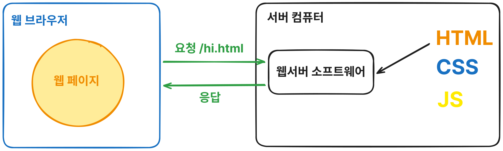
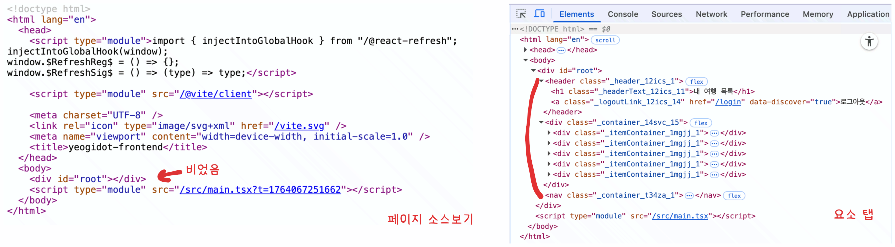
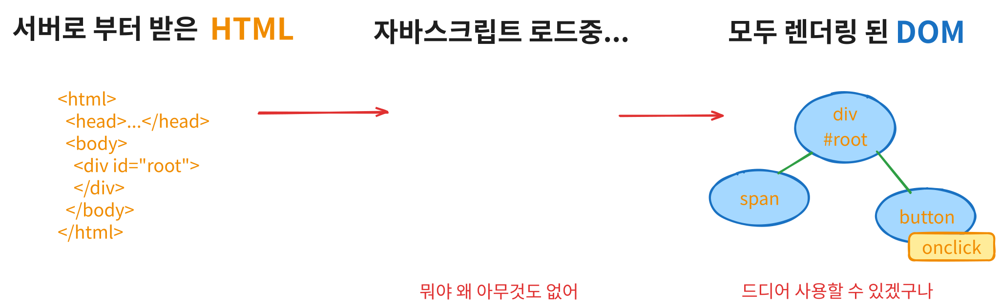
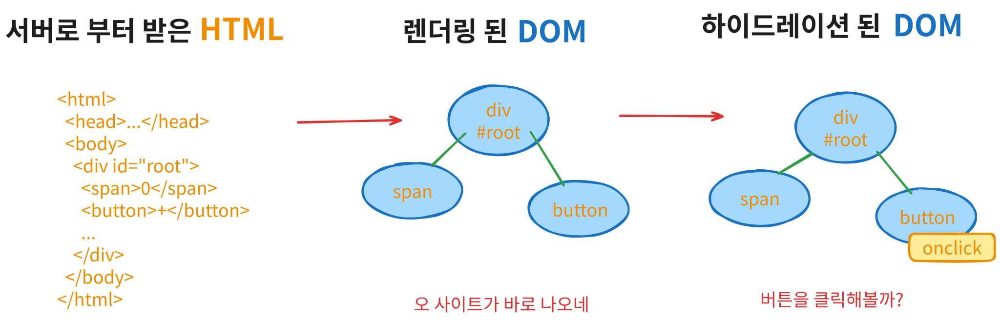

안녕하세요 여러분! 오늘은 요새 채용공고에 많이 보이는 **서버 사이드 렌더링(SSR)** 에 대해 이야기 해볼려고 합니다.

# 렌더링 이야기

## 맥락상 "렌더링"의 의미

"렌더링"은 여러 의미가 있는 단어지만, 원래 의미는 어떤 요소를 화면에 픽셀로 그리는 것입니다.
대표적으로, 웹 브라우저는 HTML, CSS, JS를 바탕으로 웹 페이지를 렌더링하는 것을 주요 기능으로 하고 있습니다.

하지만, 일반적으로 웹 개발에서 이야기하는 렌더링은 맥락에 따라 다를 수 있지만, 요소를 화면에 픽셀로 직접적으로 그리는 것 보다는 **HTML이나 DOM을 만들고 수정하는 것**에 가깝습니다.

이러한 관점에서 렌더링에 대해 알아보도록 합시다.

## 정적 웹에서 렌더링

먼저 가장 고전적인 정적 웹의 사례를 살펴봅시다.

정적 웹은 웹 브라우저가 서버의 주소로 웹사이트를 요청하면, 서버 컴퓨터에 정적 파일로 저장된 HTML, CSS, JS를 요청에 맞게 Apache, Nginx, IIS와 같은 웹 서버 소프트웨어가 응답하여 제공하는 방식으로 동작합니다.

웹 브라우저는 서버로 부터 받은 HTML을 바탕으로 DOM을 만들어내기 때문에, 매번 다른 페이지를 방문할 때 마다 페이지 전체가 새로 렌더링됩니다. 이 때 사용자는 웹사이트가 부자연스럽게 "깜빡" (흰 화면이 순간적으로 등장하는 것)한다거나 하는 경험을 할 수 있습니다.

또한, 이런 정적 웹은 사용자에 따라서 동적으로 페이지를 만들 수 없었기 때문에 서버 측에서 HTML을 만들어 줄 수 있는 JSP, PHP와 같은 도구가 등장하게 됩니다.

## Single Page Application과 클라이언트 사이드 렌더링

아쉽게도, 서버에서 동적으로 HTML을 만드는 방법도 새로 HTML을 받아서 브라우저에서 렌더링하기 때문에 페이지를 이동할 때, 화면이 깜빡한다거나 하는 문제를 해결할 수 없었습니다.

그래서 페이지를 이동할 때 서버에 각 페이지 별로 HTML을 요청하지 않고, **클라이언트의 하나의 페이지에서 자바스크립트로 처리**하는 방법이 등장했는데, 그것이 바로 **Single Page Application 줄여서 SPA**입니다.

보통 SPA 라이브러리로 만들어진 웹 페이지는 서버로 부터 body에 div 태그 하나를 제외한 다른 태그는 아무것도 없는 빈 깡통같은 HTML만 받고, DOM 요소를 렌더링 한 다음, SPA 라이브러리를 포함한 JS 파일을 다 받고, 실행해야 비로소 모든 요소를 렌더링하고 웹 페이지를 정상적으로 사용할 수 있습니다.

실제로 브라우저에서 소스보기를 하면, body 태그에 `

` **태그만 존재하고** **하위에 아무런 HTML 태그가 없지만, 개발자 도구의 요소 탭에는 있는 것을 보실 수 있습니다.**

**서버에 새 HTML을 요청하지 않고, 자바스크립트로 DOM 요소를 렌더링한다.** 이것이 클라이언트 사이드 렌더링입니다.

### 클라이언트 사이드 렌더링의 단점

하지만 클라이언트 사이드 렌더링 역시 단점이 있습니다.

서버로 부터 거의 내용이 없는 HTML을 받고 자바스크립트가 모두 로딩을 마친 상태에서 렌더링되기 때문에 **초기 로딩에 시간이 걸려 사용자 경험을 해치게 됩니다.** 또한 전통적으로 검색엔진은 봇이 사이트의 HTML을 분석하여 검색엔진에 노출하기에 **SEO 관점에서 문제**가 있습니다.

## 서버 사이드 렌더링

### 원래 의미 (원조)

사실 서버 사이드 렌더링의 원래 의미는 간단합니다.
서버에서 HTML을 만들어서 클라이언트로 보내면 서버 사이드 렌더링입니다.

그래서 따지고 보면 JSP, Flask, PHP 모두 서버 사이드 렌더링이라고 할 수 있습니다.

### 요즘의 서버 사이드 렌더링

물론 당연히 최근 프론트엔드 개발자 자격요건에서 이야기하는 서버 사이드 렌더링은 그게 아닙니다.

요즘 말하는 서버 사이드 렌더링은 서버에서 HTML을 만들고, 클라이언트에서 추가적인 과정을 통해서 DOM 요소에 이벤트와 이벤트 핸들러를 추가하는 방식(Hydration)으로 동작합니다.

대표적으로 리액트를 예로 들면, 서버 측에서 컴포넌트를 HTML로 만들고 클라이언트에 하이드레이션 로직이 작성된 JS를 함께 보냅니다.

서버에서 받은 HTML이 웹 브라우저에서 DOM 요소로 렌더링 되고, JS가 로드 되면, 하이드레이션 로직이 실행되어 이미 렌더링된 DOM 요소에 이벤트와 이벤트 핸들러를 추가합니다.

사용자 입장에서 생각해보면, 처음에 HTML이 DOM 요소로 렌더링되어 화면에 먼저 보이면서 사용자가 페이지가 로드되었다고 인식할 수 있고, JS가 로드되면 인터랙션에도 지장이 없기 때문에 좋은 사용자 경험을 줄 수 있습니다.

또한 검색엔진의 봇 입장에서도 HTML이 존재하기 때문에 쉽게 페이지를 분석하여 검색엔진에 노출할 수 있습니다. 사용자 경험, SEO를 모두 챙길 수 있는 것이죠.

### 요즘 서버 사이드 렌더링의 단점

물론 서버 사이드 렌더링이 모든 문제를 해결하는 것은 아닙니다.

서버 사이드 렌더링은 이름처럼 HTML을 만들어 줄 **서버가 필요**하고, 사용자의 요청에 따라 HTML을 만들어줘야 하기 때문에, **요청이 많을 경우 서버에 부하**가 생기는 문제가 있습니다.

또한 초기 HTML을 서버에서 만들기 때문에 당연히 **웹 브라우저 관련 객체에 직접 접근하는 코드를 작성해도 동작하지 않을 수도** 있어서 적절히 처리해야합니다.
(저도 `window` 객체에 있는 `localStorage`에 접근할 수 없어서 당황한 적이 있었네요 ㅎㅎ)

또한 하이드레이션 역시 자바스크립트가 로드되어야 하기 때문에 **웹 페이지의 모든 기능을 바로 사용 못할 수도** 있습니다.

# 정리 및 결론

정리하자면, 기존의 페이지 이동시 HTML을 항상 새로 요청하고, 렌더링해야하는 것을 자바스크립트를 통해 웹브라우저에서 처리하는 클라이언트 사이드 렌더링 방식이 등장했습니다. 그런데 클라이언트 사이드 렌더링도 초기 로딩이 오래 걸린다는 단점과, SEO의 단점이 있었죠.

그래서, 단순히 HTML을 만들어내는 서버 사이드 렌더링과 클라이언트 사이드 렌더링을 절충한 현재의 서버 사이드 렌더링이 나오게 된 것입니다.

물론 현재의 서버 사이드 렌더링도 위에서 말한 것 처럼 만능이 아니기 때문에 **상황에 따라서 전략적으로 사용**해야 한다는 것이 결론입니다.

## 참고하면 좋은 글

추가적으로 서버 사이드 렌더링에 대해 참고하면 좋은 글입니다.

[Rendering on the Web](https://web.dev/articles/rendering-on-the-web)

구글에서 운영하는 web.dev에서 작성한 렌더링에 대한 글입니다. 각 렌더링 방식을 각종 웹 성능지표를 비교해서 잘 설명하고 있습니다.

[React SSR (서버 사이드 렌더링) 얕게 시작해보기 (React.hydrateRoot)](https://solo5star.dev/posts/44/)

웹팩과 리액트 `hydrateRoot` API를 사용해 직접 서버 사이드 렌더링을 구현하는 글입니다. 백문이불여일타, 백번 보는 거 보다 한번 타이핑해보는 게 더 이해가 잘 된다고 생각합니다. 글을 따라서 구현하다 보시면 어느 새 서버 사이드 렌더링에 대해 이해하실 수 있을 겁니다.

[hydrateRoot](https://ko.react.dev/reference/react-dom/client/hydrateRoot)

리액트 공식문서의 `hydrateRoot` API 설명입니다. 리액트에서 하이드레이션을 처리하는 방법에 대해 잘 나와있어서 추천드립니다.

## 마치며

오늘은 서버 사이드 렌더링에 대해 알아보았는데요. 무심코 Next.js를 쓰면서 정작 서버 사이드 렌더링 개념에 대해서는 추상적으로만 알고 있었는데, 글을 쓰면서 많이 배웠던 것 같네요. 다음에 시간이 있으면 리액트와 vite로 직접 서버 사이드 렌더링을 구현 한 번 해보고 싶습니다.

그럼 읽어주셔서 감사하고, 다음에 더 좋은 글로 찾아뵙겠습니다.
(언제든지 잘못된 점이나 질문 있으시면 연락해주세요!)
