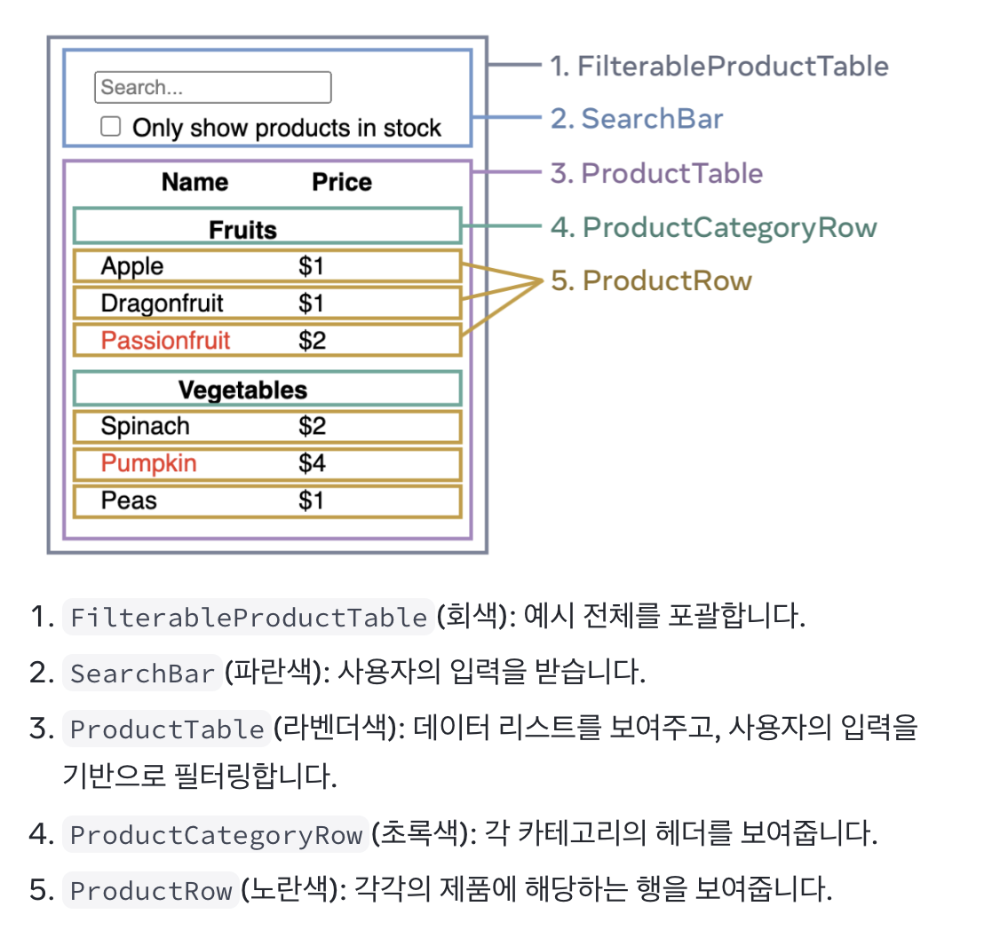

## 개요
최근 다른 프로젝트 코드를 수정해야할 일이 있었습니다.
프로젝트는 React(18), react-router(v7), vite로 아래와 같은 구조로 이루어져 있었습니다.

```
├── public/
│   ├── favicon.ico
│   └── images/
│       └── ... (이미지 파일 다수 생략)
├── README.md
├── src/
│   ├── App.tsx
│   ├── main.tsx
│   ├── pages/
│   │   └── ... (세부 파일 다수 생략, 단 Routes.tsx만 표시)
│   │       └── Routes.tsx
│   ├── type/
│   │   └── ... (타입 정의 파일 다수 생략)
│   ├── utils/
│   │   └── ... (유틸 파일 다수 생략)
├── tests/
│   └── ... (테스트 파일 다수 생략)
│ ... (기타 파일 생략)
```

간단히 설명을 드리자면 `Routes.tsx`는 `pages` 에 있는 페이지 컴포넌트를 주소에 따라 라우팅해주는 컴포넌트입니다.  react-router의 Data 모드의 방법 중, `createBrowserRouter()` API로 라우팅을 구성했고, router 배열을 컴포넌트 외부에 선언했습니다.

그런데 프로젝트 수정 중, 여러 각 페이지 컴포넌트에서 공통적으로 사용하는 상태가 있었고, `Props`로 각 페이지 컴포넌트에 내려주고 싶었습니다.  각 페이지의 부모 컴포넌트가 `Routes` 였고, 시간이 촉박한 상황이였기에 
아래처럼 컴포넌트 아래, State를 구현한다음, 자식 컴포넌트에 `Props`로 주는 방식으로 구현했습니다.  

```tsx
export function Routes() {
  const [likeStatus, setLikeStatus] = useState<{
    likes: Date[];
    score: number;
  }>({ likes: [], score: 0 });
  const addLike = () => {
    setLikeStatus((status) => {
      return { likes: [...status.likes, new Date()], score: status.score + 1 };
    });
  };
  // Routes 컴포넌트 내부에 라우터 구성, Props로 데이터 전달
  const router = createBrowserRouter([
    {
      path: '/main',
      element: (
        <MainPage
          likeCount={likeStatus.likes.length}
          recentDate={likeStatus.likes[0]}
        />
      ),
    },
    { path: '/like', element: <LikePage addLike={addLike} /> },
    {
      path: '*',
      element: <Navigate to='/main' replace={true} />,
    },
  ]);
  return <RouterProvider router={router} />;
}
```


## 문제 발생
정상적이라면, 하위 페이지 컴포넌트에서 props를 수정하는 함수를 호출하면, Props가 수정이 되고, 수정이 된 결과에 따라 렌더링이 되어야 할 터인데 아무런 변화가 없었습니다. 

그래서 문제를 해결하기 위해 프로젝트와 동일한 환경을 만들고 재현을 진행했습니다. 동일한 구조임에도 불구하고, 이번에는 **정상적으로 동작**하였습니다만, **문제의 원인을 명확히 밝힐 수 없었습니다.**

그러나, 확실히 알 수 있었던 것은, Routes.tsx 컴포넌트는 리렌더링되나, 하위 컴포넌트는 리렌더링 되지 않는 것 이었습니다.

## 문제 해결
사실 제가 사용한 방식은 권장 되지 않는 방식입니다. 그렇기 때문에 올바른 방식으로 해결 하는 게 좋다고 판단했습니다. 그 전에 왜 제가 사용한 방식이 올바르지 않은지, 그에 대한 이유를 하나씩 살펴봅시다.

### 최선이 아닌 이유
#### 공식문서에서 권장하지 않는 방식

React Router v7 문서에는 없으나, [v6 문서](https://reactrouter.com/6.30.1/routers/create-browser-router)에는 이렇게 나와 있습니다.

> Due to the decoupling of fetching and rendering in the design of the data APIs, you should create your router outside of the React tree with a statically defined set of routes.

넵, 페칭과, 렌더링을 분리하는 라이브러리 디자인에 때문에, 라우터를 리액트 트리 밖에 정적으로 정의된 경로들로 만드는 것이 좋을 것 같다라는 내용입니다. 저 처럼 리액트 트리 안에 동적으로 만드는 것이 최선은 아니라는 것입니다.

그리고 심지어 [v7 문서](https://reactrouter.com/7.9.5/start/data/route-object)에서는 `createRouterBrowser` 에 인수로 들어가는 `RouteObject`에 `element` 속성에 대한 설명은 없고, `Component` 속성에 대한 설명만 있는 걸로 봐서, 리액트 엘리먼트에 직접 `Props`를 주는 것 역시 최선은 아니다라고 말할 수 있습니다.
#### 관심사 분리가 되지 않음

리액트 공식문서에 있는 [리액트로 사고하기](https://react.dev/learn/thinking-in-react#step-1-break-the-ui-into-a-component-hierarchy)를 보시면, 프로그래밍,CSS, 디자인에 관점에서 컴포넌트를 만드는 예가 나옵니다. 프로그래밍 관점을 살펴보았을 때,
컴포넌트를 하나의 함수, 객체로 생각하면서  관심사 분리 즉, 이상적으로 하나의 컴포넌트는 하나의 기능에만 맡는 것이 좋다라는 철학을 적용할 수 있다고 하네요. 실제로 문서에서 아래와 같이 컴포넌트를 놔누었고, 컴포넌트에 대한 기능을 하나씩 적어두었습니다.



여기서 생각해보면 저의 `Routes.tsx` 컴포넌트의 역할은 **페이지 컴포넌트를 경로에 맞게 라우팅 해주는 것**이므로, 다른 컴포넌트에서 사용되는 상태와 상태를 갱신하는 함수를 갖고 있는 것 자체가 최선의 방식이 아니라고 생각합니다.
### 해결
그래서 `Routes` 컴포넌트를 안 거치고 모든 페이지 컴포넌트가 공통 상태에 접근 할 수 있는 방법이 무엇일까 생각해보았고, 리액트 `Context`를 사용하는 방법을 떠올라 사용했습니다. 
`Context`에 대해 간단히 설명하면, `Props`와 다르게 데이터를 부모 컴포넌트를 통해 받지 않더라도, 가져와서 사용할 수 있는 방법입니다. 원래 방식에서는 상위 컴포넌트의 데이터를 전달 받을려면 `Props`로 한 단계씩 부모 컴포넌트를 거쳐서 데이터를 전달 받을 수 밖에 없습니다. 

![[../../../public/props_router_versus_context.png]]


하지만 `Context` 에서는 `useContext` 훅을 통해 `Context`를 구독하면, 가장 가까운 상위 컴포넌트의 `Context.Provider`의 `value` 값을 가져와서 중간 컴포넌트를 거치지 않고 데이터를 전달 받을 수 있습니다.
저는 공통 조상인 App 컴포넌트에 `State`를 만들고 해당 컴포넌트를 감싸는 `Context.Provider`의 `value` 속성에 값을 추가했습니다. 그 결과 렌더링이 정상적으로 이루어졌고 문제를 해결할 수 있었습니다.


## 결론 및 소감

이전에는 라이브러리 코드를 사용할 때, 동작만 하면된다라는 관점으로 개발을 해왔었는데 이번 문제를 해결하면서 라이브러리 코드의 의도에 대해 파악하고, 어떻게 하면, 작성자의 의도에 맞게 좋은 코드를 작성할 수 있을까에 대한 고민도 해 볼 수 있었던 기회가 되었던 것 같습니다. 공식문서를 읽는 것도 좋은 경험이었습니다. 

읽어주셔서 감사하고, 잘못된 내용이나 질문있으시면 언제든지 말씀해주시면 됩니다! 
그럼 다음에 뵙겠습니다!