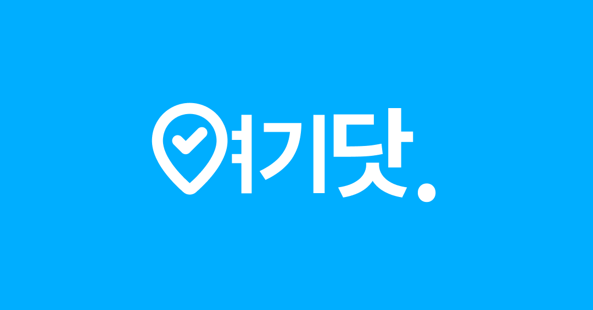
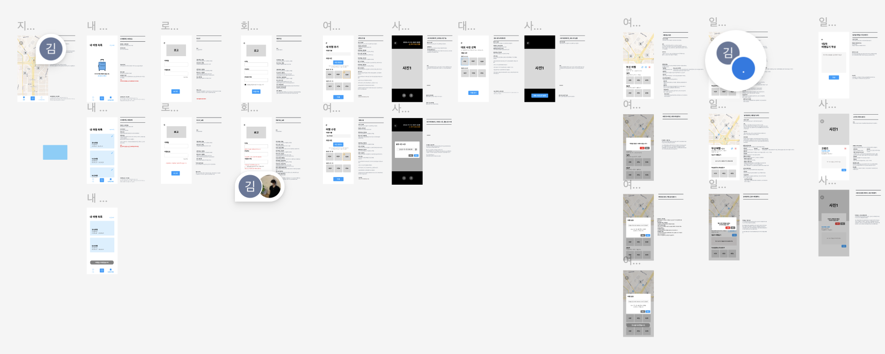

안녕하세요. 여행을 쉽게 정리할 수 있는 여기닷 플랫폼을 만들고 있는 김지홍입니다.
오늘은 여기닷이 공개까지 얼마 안 남았기에 개발과정과 느낀점을 정리해보았습니다.



# 기획

여기닷은 지난 학기 GDGoC 프로젝트 스터디에서 시작되었는데요, 저를 포함한 팀원 5명(프론트엔드 2명, 백엔드 3명)으로 이루어진 팀입니다.

프로젝트 초반에 바로 기획을 시작했습니다. 일단 여러가지 주제가 나왔지만 음식점 리뷰를 모아주는 플랫폼이라는 주제로 필수기능을 정하고, 디자인을 시작했습니다. 디자인을 거의 마치고 다음 회의에서 백엔드 측에서 음식점 리뷰 를 일반적인 API 호출로는 가져오기 어렵다는 의견을 들었고, 프로젝트 방향을 틀어야겠다고 결정했습니다.

따라서 빠르게 주제를 다시 정해야 했기에, 또 다른 의견이었던, 여행 정리를 쉽게 도와주는 서비스를 주제로 정하고 핵심기능을 정해서 프로젝트를 시작했습니다.

# 디자인

디자인은 Figma로 일단 제가 초안을 잡고, 다른 팀원에게 피드백을 받는 형식으로 진행했습니다. AI 없이 순수 피지컬로 디자인을 진행했는데, 역시 쉽지 않았습니다.



# 개발

디자인을 어느 정도 마치고, 프론트엔드 파트 개발을 시작했습니다. 일단 먼저 기술스택을 정했는데, 이 때 당시 제가 있는 프론트엔드 파트는 저 그리고

- HTML, CSS 경험만 있는 2학년
- HTML, CSS, JS 경험 있는 4학년

으로 구성되어 있었기 때문에, 기업 모집 자격요건에 흔히 적혀있는 기술을 사용하기보다는 쉽게 js, react 생태계에 적응할 수 있는 기술로 프로젝트를 구성하였습니다. 그래서 react-router, react, typescript만 중점적으로 사용하기로 결정했습니다.

## UI 개발

백엔드에서 API 명세를 받기 전에 피그마 디자인 시안을 바탕으로 UI를 만들기 시작했습니다.
제가 맡은 파트는 내 여행목록, 여행 추가 및 수정 페이지와 그 하위 페이지를 맡았습니다.

이렇게 적고 보니 별로 한 것이 없어보이지만 구현하면서 생각할 거리가 꽤 많았고 시행착오도 많았습니다.

- 업로드한 사진에서 위치와 촬영 날짜를 어떻게 추출할 것인가?
- 여행 추가 및 수정 시, 각 세부 페이지의 상태를 어떻게 공유할 것 인가?
- 사진 전체 화면 페이지에서 줌은 어떻게 구현할 것인가?
- 웹 브라우저에 사진을 올렸을 때 어떻게 처리할 것인가?
- 여행과 사진과 관련된 각종 타입을 어떻게 정의할 것인가?
- 사진 그리드에 사진 정보를 디자인 시안과 같이 어떻게 표현 할 것인가?
- 대표사진은 어떻게 설정할 것 인가?

위와 같은 많은 질문이 머릿속에서 떠올랐고 하나씩 해결해 나가면서 개발을 진행해 나갔습니다.

## API 연동

UI를 개발하는 중에 API 명세 초안이 나왔고, 백엔드 파트와 의사소통 후에 요청 및 응답형식이 명시되어 실제로 적용할 수 있는 Swagger 형태의 명세서를 볼 수 있었습니다.

사실 API 명세를 받을 때, API 역시 거의 구현되어 있는 상황이었기 때문에 바로 `fetch` 함수와 `useEffect` 를 활용하여 적용을 시작하는 것도 가능했습니다.

하지만, API의 엔드포인트의 갯수가 20개 이상이고, 토큰과 함께 HTTP 요청을 보내는 동작이 중복이 됩니다. 이 당시까지만 하더라도 API 명세와 구현이 자주 변경되었기 때문에 하나의 API가 바뀌었을 때 해당 API를 사용하는 모든 페이지에 있는 fetch 요청을 수정하기에는 너무 번거롭다고 생각했습니다. 그래서 해결법을 찾아보던 중, fetch 함수를 http 객체로 각 HTTP 메소드를 객체 메소드로 추상화하여 사용하는 방법을 알게되었고 곧바로 적용했습니다.

그리고, 도메인 별로 service 객체를 분리를 통해 서버에 API 요청을 할 때, 관련 service 객체를 import 해서 사용할 수 있게 하고, 요청을 쉽게할 수 있는 useApi 커스텀 훅을 구현하여 API 요청 후 에러, 로딩, 데이터 등의 상태를 쉽게 처리할 수 있게 구현했습니다.

```tsx
import { useEffect } from 'react';
import { useApi } from 'src/hooks/api';
import { travelService } from 'src/apis/services/travel';

export function MyTravels({ token }: { token: string }) {
  const { data, loading, error, request } = useApi(travelService.getTravels);

  useEffect(() => {
    request(token);
  }, [token]);

  if (loading) return <div>로딩중...</div>;
  if (error) return <div>에러: {error}</div>;

  return (
    <ul>
      {data?.map((travel) => (
        <li key={travel.id}>{travel.title}</li>
      ))}
    </ul>
  );
}
```

이런 준비작업을 마치고 각 페이지 별 API 연동을 진행하였습니다.

## 배포

배포는 일단 API 연동이 어느 정도 진행되었을 때, 배포를 진행해도 되겠다는 생각이 들어서
비슷한 서비스인 Vercel과 달리, Github Organization에 대해 배포 제한이 없고 월 10만건 요청이 없으면 무료인 Cloudflare Workers로 배포를 진행했고, 현재는 자잘한 이슈를 수정하며 React Native기반 Web App의 형태로 출시를 준비하고 있습니다.

# 돌아보기

사실 이번 글의 핵심인 부분입니다. 제가 만약 다음에 프로젝트를 진행한다면, 꼭 아래 내용을 신경쓰고 진행해야겠다는 생각이 들었습니다.

## 기획은 체계적으로 확실히

프로젝트 초반에 기획을 하게 됩니다. 기획을 할 때에는 프로젝트 주제, 필수기능, 일정을 정하게 되는데요. 특히 주제 및 필수기능 선정이 중요합니다.

- 주제를 팀원 모두가 납득 할 수 있는가?
- 필수기능을 구현할 수 있는가?

일단 주제는 팀원 모두가 납득할 수 있는 지가 중요합니다. 납득 할 수 있다는 것은, 다른 말로 하면 보통 **어떤 문제를 이 프로젝트를 통해 해결할 수 있다**는 **생각이 드는 것**입니다.

예를 들어, 여기닷의 경우 사람들이 여행 준비에 비해 **여행을 정리하는 것에 어려움이 있다는 문제**를 발견하고 이를 해결하기 위해 **쉽게 여행을 정리할 수 있는** 플랫폼을 만들었습니다.

이런 문제를 실제로 해결하는 것은 둘째치고 팀 내에서 이런 접근이 그럴 듯하다는 생각조차 들지 않는다면 프로젝트를 진행하다가 **의욕을 상실할 가능성이 높으니 다시 한 번 생각해보세요.**

(주제 선정은 특히 해커톤, 교내 캡스톤 디자인 대회 등에서 수상을 하기 위해서 중요합니다.)

주제를 선정하게 되면 **필수기능**을 정하게 되는데, 필수 기능이 구현 가능한 지도 확인해야합니다.
위에서 말씀드린 것 처럼, 저희 팀의 음식점 리뷰 종합 프로젝트에서는 각 지도 사이트의 장소와 리뷰 정보를 제공하는 API를 통해 사용할 수 없었기에 필수기능을 개발할 수 없다고 판단했습니다. 만약 필수 기능을 개발할 수 없을 경우 프로젝트의 방향성을 수정할 필요가 있습니다.

마지막으로 **일정**을 정합니다. 일정을 확실히 정하고 기한 내에 맡은 일을 끝내는 것은 중요합니다. 물론 일정은 언제나 달라질 수 있습니다만, 어짜피 달라지니깐 천천히 할까?라는 생각은 계속 일정을 지연시키는 주범입니다. 사실 이번 프로젝트에서 팀장인 저부터 그런 생각을 종종 했던 것 같아 죄송스럽습니다. (팀장이라면 더더욱) 일정을 지키고 관리해야합니다.

## 디자인보다 개발

정말 간단하게 필수기능을 담은 디자인을 만들고 다른 팀원에게 빠르게 피드백을 받는 것이 좋습니다. 다른 사람에게 의견을 받는 과정을 통해 놓치는 부분을 찾기 쉽기 때문입니다.

그리고 정말 중요한 디자인은 직접 해야겠지만(그 마저도 공통 컴포넌트를 만들고, 최대한 사용해서), 공통되고 이미 정형화된 것은 [MUI](https://mui.com/), [shadcn ui](https://ui.shadcn.com/)같은 라이브러리를 활용하거나 AI를 통해 디자인해도 좋을 것 같습니다. 아까도 말씀드렸다시피 여기닷에서는 제가 손수 디자인을 하고, 각자 맡은 부분을 거의 하나 하나 직접 구현했습니다만, 현대 PC나 모바일에서 사용하는 UI는 대부분 정형화 되어있습니다. 그렇기에 매번 모든 UI 요소를 디자인하고 만드는 것은 학습에 도움은 되지만 개발 속도를 지체할 수 있습니다.

## API 명세는 팀원 전체가 봐야하는 것

디자인이 끝나게 되면, 디자인을 토대로 백엔드는 데이터베이스를 설계하고 API 명세를 정하기 시작합니다. (백엔드에서 API를 만들기 때문에 백엔드의 역할이라고 생각합니다.)

다만 백엔드 파트는 디자인에 대한 사전 정보가 없기 때문에 프론트엔드 측에서 어떤 데이터가 필요한지 전달해주면 좋을 것 같습니다. 사실 여기닷 프로젝트에서는 백엔드에 모든 것을 맡겼습니다만, (죄송합니다 저도 잘 몰랐습니다.) API 구현 후에 많은 수정 과정을 거치지 않을려면, **꼭 초기에** 프론트엔드에서 주어진 명세로 기능을 구현할 수 있는 지 확인하고 백엔드 파트에 피드백을 해야합니다.

보통 백엔드 측에서는 자바 스프링을 많이 사용하기에 [Swagger](https://swagger.io/) 툴을 통해서 간단한 API 명세를 만들 수 있습니다. 이 때 API에 대한

- **엔드포인트 주소**
- **요청 형식**
- **응답 형식**
- 간단한 설명

은 반드시 있어야 합니다. 특히 요청과 응답 형식이 없다면, 프론트엔드에서는 요청,응답을 유추해서 타입을 만들고 UI를 만들게 되는데 결국 수정을 해야하는 일이 발생합니다.

그리고 API가 수정이 필요하거나 수정이 완료되면 그 즉시 다른 파트에 공유되어야 프론트엔드나 백엔드 모두 올바른 방향으로 개발을 진행해 나갈 수 있습니다.

## 당신이 팀장이라면

저도 프로젝트에서 팀장을 몇 번 해봤지만 참 어렵습니다. 본인 개발 파트도 진행하면서, 일정이나 진행상태 체크, 업무 분배 등 팀 전반의 일도 해야하기 때문입니다.
하지만 저는 여기에 지름길은 없다고 생각합니다. 결국 나중에는 좋든 싫든 팀을 이끌어야하는 순간이 옵니다. 그래서 저는 미리 여러번 경험하여 익숙해지는 것이 최선이라 생각합니다.

추가적으로 팀장이라면 어느 정도 각 개발 파트(백엔드, 프론트엔드, 배포 등)에 대한 경험과 지식이 있으면 일정 조율, 업무 분배 등에 큰 도움이 됩니다. 그래서 프로젝트를 처음부터 배포까지 해본 경험이 그래서 중요한 것이라 생각합니다.

다만, 그러한 경험 및 지식을 바탕으로 각 파트의 모든 개발 내용을 하나 하나 간섭해라는 이야기는 절대 아닙니다. 만약에 다른 팀원이 충분히 할 수 있는 일임에도 본인이 하게 된다면 팀장으로사용할 수 시간은 줄어들고, 해당 팀원은 배움의 기회를 잃어버릴 수 있기 때문입니다.

## 당신이 팀원이라면

팀장의 관점에서 생각했을 때, 학교 프로젝트에서 (요즘은 AI도 있으니) 솔직히 실력은 물론 기본적인 지식은 있어야 하겠지만, 크게 상관은 없다고 생각합니다.

오히려 실력이 부족하다면 열정으로 채우면 되는 거 아닐까요? 프로젝트에 열정을 갖고 참여하다 보면 자신이 부족한 부분을 발견하게되고 그 부분을 채우기 위해서 자연스레 더 노력하게 되기 때문입니다.

그래서 **얼마나 적극적으로 열정을 가지고 참여할 수 있는가** 그것이 가장 팀원(팀장 포함)에게 중요하다 생각합니다.

# 마치며

여기닷 프로젝트 진행하면서 프로젝트를 그냥 진행하는 것과 사람들에게 공개하는 것은 전혀 다르다는 것을 깨달았습니다. 프로젝트를 공개한다는 것은 사용자가 쓰게 하는 것에 목적이 있기에 완성도와 경험의 수준이 일반적인 프로젝트보다 훨씬 큽니다.

그래서 지난 대학 4년간의 시간동안 이런 프로젝트를 좀 더 많이 했으면 좋았을 거라 생각이 드네요.
저 역시 항상 프로젝트를 실력이 부족하다는 이유, 학업을 핑계로 주저하거나 대충 마무리지었던 기억이 많은데, 이제 와서 돌이켜보니 아쉬운 마음이 큽니다. 좀 더 도전했으면 정말 좋은 경험이었을 것인데 말이죠. 또 하나 배워갑니다.

그리고 한 가지 더,
무엇보다도 함께하고 **열심히 참여하고 있는 여기닷 팀원들에게 진심으로 감사합니다.**
덕분에 여기까지 포기하지 않고 개발할 수 있었던 것 같아요.

아무튼 긴 글 읽어주셔서 감사하고 다음에 더 좋은 글로 찾아뵙겠습니다!

감사합니다.
